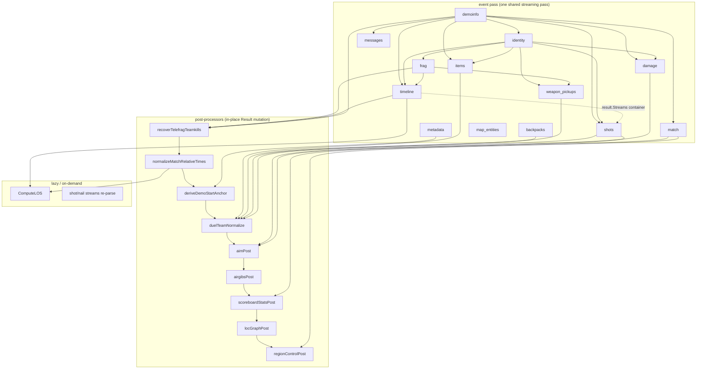

# PLAN — Extensible analytics as an explicit DAG

Status: **IMPLEMENTED (2026-07-07)** — Stages 1–4 shipped as phases 6–9
on the stacked branches `phase-6`…`phase-9` (Opus-implemented,
Fable-verified; goldens byte-identical through Stages 1–2, additive-only
in 3–4, no schema bump — stays v49). Per-stage records:

- **Stage 1 / phase-6** (`db4bf36`): nodeSpecs + validation + Kahn topo
  sort (registration-index tie-break, provably == legacy order, enforced
  by test); `qw-analyze -graph {mermaid,json}`.
- **Stage 2 / phase-7** (12 commits, `phase-7` tip `dd7a5f2` (rebuilt 2026-07-07, see phase-10 note)): `clock` and
  `roster` core artifacts; every producer stamps match-relative times
  and duel-final team labels at Finalize; `normalizeMatchRelativeTimes`,
  `deriveDemoStartAnchor`, `duelTeamNormalize` deleted; `epoch:match` /
  `teams:final` barriers retired. Verified byte-identical on 14 real
  demos incl. pause, reconnect, no-match-start and full-streams paths.
  *Deferred:* converting recover-telefrag-teamkills / scoreboard-stats
  into final-artifact producers — zero output change, not load-bearing
  for Stages 3–4; their `Mutates` flags remain as debt markers.
- **Stage 3 / phase-8** (`phase-8` tip `b03a840`): `los` + `shot-streams` as
  generic lazy artifacts (one-variant per api F12); tier-3 cache
  `artifacts/<sha[:2]>/<sha>/<name>@v<schema>.gob` — lazy computes
  survive restarts/evictions (closes api F8b). EV = schema version for
  now; per-node effective versions deferred until node versions diverge.
- **Stage 4 / phase-9** (`phase-9` tip `72295bb`): `GET /v1/artifacts`,
  `GET /v1/demos/{id}/artifacts/{name}` (closed registry, no params,
  per-artifact ETags), `GET /v1/graph`; MCP `listArtifacts`/`getArtifact`
  generated from the manifest (curated tools deliberately kept as the
  ergonomic surface); generated `mvd-analytics/ARTIFACTS.md` with a
  drift-failing test. *Deferred:* per-deployment Heavy-disable knob.

- **Stage 5 / phase-10 (added 2026-07-07)** — order independence: the
  Stage-1 registration-index tie-break froze the legacy order so the
  goldens could referee; the target property is stronger — ANY valid
  topological order must produce byte-identical output (goldens, ETags
  and gob caches all assume output is a pure function of the input).
  Phase 10 (a) canonicalizes order-sensitive sinks (`Result.Errors`
  append order), (b) adds an N-seed shuffled-order test asserting
  byte-equal JSON — which also continuously verifies the declared edge
  list is COMPLETE (an undeclared cross-node read surfaces as a shuffle
  diff), and (c) records PhaseTimings measurements over the corpus to
  answer open question 3 (parallel Finalize) with data. Scheduling by
  readiness/critical path becomes safe once (a)+(b) hold; actual
  parallelism stays deferred behind the measurements.

  **Phase-10 outcome (2026-07-07, branch `phase-10` tip `39099fa`):**
  `Result.Errors` canonicalized (stream-abort first, then lexicographic);
  `TestOrderIndependence` (3 corpus demos × default + 3 seeded shuffled
  valid orders, byte-equal JSON) passes — the pipeline is genuinely
  schedule-free and the declared edge list is complete. **Measured
  timings (mean over the 10-demo corpus)** answering open question 3:
  event pass ≈ 1316 ms; Finalize+post tail serial ≈ 1672 ms of which
  `timeline` alone is ≈ 1580 ms (~94%); tail critical path ≈ 1616 ms →
  best-case parallel tail speedup **1.03×**. Conclusion: a parallel
  scheduler over the DAG tail buys nothing; any real win lives inside
  the timeline analyzer or in overlapping it with the parse. `los`
  (lazy, off-path) ≈ 2455 ms. Parallelism: **not worth building now.**

  **Incident recorded:** phase-7's clock migration extracted the shift
  helpers into `analyzer/timeshift.go` but never staged the new file —
  phases 7–9 built only in the dirty working tree and were unbuildable
  from a clean clone. Caught by the phase-10 agent, fixed by rebuilding
  the stack with the file in its home commit (hence the new SHAs above;
  phase-7/8/9 force-pushed). Standing gate added: every phase tip must
  build in a fresh `git worktree`.

The sections below are kept as the design rationale of record.

> Updated 2026-07-05 against main @ 05e2ed9 (schema v47); pipeline inventory in §1 re-verified after merging #98–#102.
> Phases 0–5 of PLAN-implementation-order are implemented (2026-07-06); Stage 1 is unblocked and next. The §1 inventory below was re-verified after those phases.

Goal: make mvd-analytics extensible so that a contributor can add an
analytics package by declaring **what it needs and what it produces**,
have the engine schedule it correctly, compute it lazily (and cache it)
when nobody upstream needs it eagerly, visualise how everything
connects, and have mvd-api expose it automatically.

This document covers: (1) the current *implicit* DAG, reverse-engineered
edge by edge; (2) an assessment of the approach — benefits, challenges,
and where the naive version goes wrong; (3) design options at three
ambition levels; (4) a recommended staged path; (5) the contributor
story ("add a node without reading anyone else's code"); (6) automatic
API exposure.

---

## 1. Where we are: the current implicit DAG

### 1.1 Execution model

`Registry.analyzeSource` (analyzer/registry.go:171) runs four fixed
tiers; **ordering inside each tier is registration order**, set once in
`NewDefaultRegistry` (registry.go:309):

1. **Event pass** — one streaming pass; every analyzer's `OnEvent` sees
   every event (core slice first, then derived slice). Since phase 2
   (cda9940) a truncated stream stops the pass and records
   `"event stream aborted: …"` into `Result.Errors`
   (registry.go:200-215, 246-248) — partial results still finalise, and
   a consumer can tell a truncated parse from a clean one.
2. **Core Finalize** — `demoinfo` → `identity` → `frag`. Each populates
   `CoreOutputs` via `PopulateCore` right after its own `Finalize`, so a
   later core node can read an earlier one's fields.
3. **Derived Finalize** — `metadata` → `match` → `messages` → `timeline`
   → `items` → `damage` → `shots` → `map_entities` → `backpacks` →
   `weapon_pickups`. All see the fully-populated `CoreOutputs`.
4. **Post-processors** — `recoverTelefragTeamkills` →
   `normalizeMatchRelativeTimes` → `deriveDemoStartAnchor` →
   `duelTeamNormalize` → `aimPost` → `airgibsPost` →
   `scoreboardStatsPost` → `locGraphPost` → `regionControlPost`.
   Plain functions mutating the assembled `Result`.

Outside the pipeline there are already **two ad-hoc lazy nodes** (a
third, `tracks.ExtractTracks`, was shelved scaffolding with zero callers
and was deleted in phase 4, f494471 — if revived it enters as a new lazy
node):

- `ComputeLOS` (analyzer/los.go:42) — heaviest pass, computed on demand,
  idempotent via the `Streams.LOSComputed` latch. Cached on the
  *in-memory* Result only: the gob is written once at parse time and
  never re-encoded, so LOS recomputes after an LRU eviction
  (mvd-api/handlers.go:575 — "the on-disk gob stays lean"; the
  result/streams.go:32-43 doc now states exactly this, fixed in
  phase 0).
- Shot/nail spatial streams — `democache.EnsureShotStreams`
  (mvd-api/internal/democache/cache.go:268) *re-parses the cached MVD
  bytes* with `BuildShotStreams`/`BuildNails` on, splices the streams
  onto the in-memory Result, latches
  `ShotStreamsComputed`/`NailsComputed`. Since v44–v47 it also grafts
  the rebuilt `Shots` and `Aim` blocks onto the cached Result — their
  stream-derived parts (RL/GL direct/splash, the LG whiff split) exist
  only in the enriched parse. That is a hand-maintained dependency cone:
  the lazy pass recomputes three artifacts by name because the engine
  cannot express `aim ← shots ← streams`. Phase 3 (6179589) hardened the
  mechanics without changing them: the rebuild is serialised per demo
  SHA (the need-check sits under the lock, closing a TOCTOU), and if the
  tier-1 bytes were evicted it degrades explicitly
  (`meta.ShotStreamsUnavailable`) instead of serving silently-incomplete
  data. Phase 5's one-entry BSP caches (mapbsp bytes + locvis Finder)
  also make each re-parse cheaper — its repeated BSP loads now hit the
  in-process cache.

And one family of **pure parameterised reads**: `view/` (Buckets,
Events, StreamSlice, StateAt, LocTrails, RegionControl) — computed per
request, never cached. These are *not* DAG nodes and should stay that
way (see §3.4).

### 1.2 How dependencies are expressed today (four different mechanisms)

| Mechanism | Example | Checked when |
|---|---|---|
| `CoreProducer`/`CoreConsumer` interfaces | frag reads `co.Names`, weapon_pickups reads `co.FragEntries` | compile time (interface exists) — but *which fields* is invisible |
| Registration order within a slice | identity after demoinfo; shots after timeline | never — silently wrong if reordered |
| Post-processor registration order | telefrag recovery before time normalisation | never — comments only |
| Reads of `result.*` written by an earlier node | aimPost reads `Shots` + `Streams` + `Damage` | never |

### 1.3 The edge list (reverse-engineered 2026-07-02, re-verified 2026-07-05 @ 05e2ed9 and 2026-07-06 @ 9016832 post-phases-0–5)

**Via CoreOutputs:**

```
demoinfo → identity                     (ctx.DemoInfo, read in PopulateCore)
demoinfo → frag, messages, match, timeline, items, damage, shots
                                        (co.DemoInfo / co.Names / co.Slots)
identity → frag, timeline, items, damage, shots, weapon_pickups
                                        (co.Sessions via ResolveSlotAt,
                                         core_outputs.go:146 — phase 5 replaced
                                         five per-analyzer resolution copies
                                         with this one helper; same edge,
                                         now one mechanism)
frag     → timeline                     (co.FragEntries: streaks, powerup frags)
frag     → weapon_pickups               (co.FragEntries: kill attribution)
frag     → recoverTelefragTeamkills     (co.VictimNamedTeamkills)
demoinfo → recoverTelefragTeamkills, airgibsPost
                                        (co.Names.TeamForName — team fallback for
                                         players missing from streams)
```

**Hidden intra-derived edge (the registry comment "no derived analyser
depends on another's output" — registry.go:327 — is wrong):**

```
timeline → shots                        (shots.buildSpatialStreams, shots.go:364-401,
                                         writes Projectiles/Beams/Nails INTO
                                         result.Streams, which timeline creates;
                                         if timeline were unregistered, shots
                                         silently drops them)
```

(A related non-edge closed by phase 5: frag and messages each carried a
~250-line obituary pattern table that had drifted apart — a semantic
coupling invisible to any dependency mechanism, since both are pure
event consumers. adc4ce5 collapsed them into one parser,
analyzer/obituary_parse.go, with frag.go's semantics as the reference.
No scheduling impact, but it retires a drift class the DAG could not
have expressed anyway.)

**Via result.\* into post-processors:**

```
frag, timeline           → recoverTelefragTeamkills   (Frags, Streams positions, FragEvents)
timeline                 → normalizeMatchRelativeTimes (Streams.Global.MatchStart)
metadata, timeline       → deriveDemoStartAnchor       (ServerInfo["epoch"], DemoStartAccuracyMs)
demoinfo, match, frag,
timeline, messages,
items, shots, backpacks,
weapon_pickups           → duelTeamNormalize           (rewrites team labels everywhere;
                                                        since v45/v46 also pickup Team/
                                                        DropperTeam, backpack + shot Team,
                                                        the VictimKinds team→enemy flip and
                                                        the per-weapon TeamHits→EnemyHits fold;
                                                        since v48 (phase 1) also
                                                        Streams.KillEvents[].Team — and
                                                        normalizeMatchRelativeTimes had to
                                                        learn KillEvents[].Time in the same
                                                        fix, postprocess.go:47-48)
shots, timeline, damage  → aimPost                     (Shots incl. Victims/VictimKinds v44/v45,
                                                        Streams.{Position,Spawns,Deaths,
                                                        Projectiles,Beams}, Damage.Events)
damage, timeline, frag,
demoinfo                 → airgibsPost                 (Damage.Events, Position.H/Li, LocTable,
                                                        Frags, co.Names)
match, frag, recoverTK   → scoreboardStatsPost         (writes Match.Players Kills/Deaths/Suicides)
timeline, demoinfo       → locGraphPost                (LocTable, LocationData, Streams, DemoInfo teams)
timeline, match, demoinfo→ regionControlPost           (RegionControl.Regions, Streams; calls view.RegionControl)
```

**Ordering barriers (not data edges — global rewrites):**

```
recoverTelefragTeamkills BEFORE normalizeMatchRelativeTimes   (shared demo clock)
normalizeMatchRelativeTimes BEFORE aim/airgibs/locgraph/regionControl (time base)
duelTeamNormalize BEFORE aim/scoreboard/locgraph/regionControl (team labels)
```

**Lazy, out-of-band:**

```
timeline, demoinfo → ComputeLOS         (Streams positions/movers, DemoInfo.Map; after time normalisation)
```

### 1.4 The same thing as a picture



Two structural observations fall out of this map:

1. **Almost every edge flows through five hub artifacts**: `DemoInfo` /
   `Names` / `Sessions` (identity cluster), `FragEntries`, and
   `Streams`. The graph is wide but shallow — good news for a DAG
   conversion; the artifact vocabulary is small.
2. **The post-processor chain is not a DAG today** — it is a serial
   pipeline of *in-place rewrites over shared state*. Two of them
   (`normalizeMatchRelativeTimes`, `duelTeamNormalize`) rewrite fields
   across nearly every result section, which makes "everything depends
   on them" true and useless. And the rewrite set keeps growing:
   #99/#100 (v45/v46) had to teach `duelTeamNormalize` four more
   sections by hand — items, backpacks, weapon pickups, shots (including
   a VictimKinds reclassification) — and phase 1 (v48) found the drift's
   cost the other way round: `Streams.KillEvents` had shipped *missed by
   both rewriters*, so every kill was ~demoOffset late with wrong duel
   teams until both were hand-extended (3ebc9cd;
   `TestTimelineInvariants` now walks the goldens generically so the
   next missed field fails a test). This — not the analyzer tier — is
   the real architectural debt (see §2.2, challenge 2).

---

## 2. Is the approach correct? Benefits, challenges, verdict

### 2.1 Benefits (real ones)

- **Correct-by-construction ordering.** Today four mechanisms express
  ordering and only one is checked. `weapon_pickups.go:43` carries a
  comment "MUST be registered after FragAnalyzer" — comments are not
  constraints (and they decay: the ordering comment inside
  `analyzeSource` listed only six of the nine registered
  post-processors until phase 0 completed it, registry.go:280-293 —
  nothing but review keeps it true). Declared deps + topo sort make wrong wiring a startup
  error, not a silent data bug (the timeline→shots hidden edge is
  exactly the kind that bites during a refactor).
- **Extensibility without archaeology.** A contributor declares
  `requires: [streams, locTable]` and writes one build function. They
  read an artifact catalog, not thirteen analyzers.
- **Visualisation for free.** The graph exists as data → `qw-analyze
  -graph mermaid`, `/v1/graph`, and PhaseTimings annotate each node
  with measured ms. Today this document is the only map, and it decays.
- **Principled laziness + caching.** LOS, shot streams, nails, tracks
  are already lazy — but each hand-rolls its own latch, cache splice,
  and endpoint. A DAG generalises the pattern: any node marked lazy
  gets on-demand build + per-artifact cache + endpoint automatically.
- **Cheap wins later**: parallel Finalize of independent nodes
  (aim/locgraph/airgibs are embarrassingly parallel; PhaseTimings
  already tells us where it pays), per-node cache invalidation (bump
  one node's version, recompute only its cone), per-artifact goldens.

### 2.2 Challenges (be honest about these)

1. **Laziness has poor ROI at the event tier.** All 13 analyzers share
   one streaming pass whose cost is dominated by *parsing*, not by the
   collectors. Skipping `backpacks` saves microseconds; you cannot skip
   the parse. Lazy evaluation of event-tier nodes therefore means
   *re-parsing* (what `EnsureShotStreams` does) — acceptable for opt-in
   heavy decodes (nails), pointless as a general strategy. **The
   default posture should stay "one pass computes the base bundle";
   laziness pays at the derived/post tier and for heavy passes.** A
   plan that promises "only required pieces are computed" at every tier
   over-promises.
2. **The global rewrites are the real blocker.** A DAG wants immutable
   artifacts; `normalizeMatchRelativeTimes` and `duelTeamNormalize`
   mutate nearly everything after the fact. Keeping them as nodes gives
   you a DAG where every artifact has a false edge to both — no
   laziness, no parallelism, no honest graph. The enabling refactor is
   to make artifacts **born correct**: a `clock` artifact (match epoch,
   from the existing matchtiming state) and a `roster` artifact
   (identity + teams + duel rewrite folded in) produced in the core
   tier, consulted by every producer at Finalize. Then the two barrier
   mutators disappear. This is the risky, valuable part of the whole
   plan — everything else is bookkeeping. (#100 sharpened the point:
   shipping weapon-stay pickups meant hand-extending the duel rewrite
   to four more result sections — with `roster`, those fields would
   have been born with the right labels.)
3. **Result is a stable JSON contract.** Third-party nodes must not
   churn `result.Result` / `CurrentSchemaVersion`. Extension artifacts
   should live *outside* Result (own endpoint, own golden), with the
   assembled Result being simply "the bundle of core artifacts".
4. **WASM constrains "plugin".** Go has no usable runtime plugin story
   (the `plugin` package is linux-only, cgo, and dead on WASM — and the
   same pipeline must run in the browser). "Plug in packages" therefore
   means **compile-time registration** (import + register, like
   database/sql drivers), not runtime loading. That is fine — it still
   delivers "add a package without touching existing files" via a
   single wiring point or `init()` self-registration.
5. **Determinism.** Topo order must be stable (tie-break by node name)
   or golden files churn. Parallel Finalize must not reorder
   append-to-shared-slice writes (today every failing node's Finalize
   error is appended to the shared `result.Errors` slice — one site,
   `finalizeOne` at registry.go:264, plus the stream-abort append at
   registry.go:247, but one append per failing node). Phase 5 already
   paid down the intra-node side of this: powerup detection and
   interval-event emission iterate in documented sorted order, so
   Finalize output is byte-stable under GOMAXPROCS variation (adc4ce5).
6. **Don't over-engineer.** The whole surface is ~13 analyzers + 9
   post-processors + 3 lazy passes. The engine must stay small
   (~300 LOC: registry, topo sort, memo, cache adapter). If the
   framework outgrows the analytics, we took a wrong turn. No
   reflection-driven magic beyond registration-time validation.

### 2.3 Verdict

The direction is correct, and the codebase has been *converging on it
for a while*: `CoreProducer`/`CoreConsumer` exists precisely because
registration-order dependencies burned us before; `LOSComputed` /
`ShotStreamsComputed` / `NailsComputed` are hand-rolled lazy-node
latches; `PhaseTimings` is per-node instrumentation waiting for a graph
to annotate. The DAG proposal is the generalisation of three patterns
the repo already invented ad hoc.

Two corrections to the framing:

- The payoff is **extensibility, correctness and cacheability**, not
  raw speed. Lazy evaluation is the right model for the derived tier
  and heavy passes; the event pass stays a single shared node.
- The prerequisite is **killing the two global rewrites** (clock, duel
  teams). Do that first or the "DAG" is a serial pipeline wearing a
  graph costume.

---

## 3. Design

### 3.1 Node model

One node kind, two capabilities:

```go
// dag.NodeSpec — everything the engine needs, declared as data.
type NodeSpec struct {
    Name     string      // unique, kebab-case: "frags", "loc-graph", "los"
    Version  int         // bump to invalidate this node's cache (and its cone)
    Requires []string    // artifact names this node's Build reads
    Provides []string    // artifact names (usually one) this node writes
    Policy   Policy      // Eager (default bundle) | Lazy (on demand)
    Cost     Cost        // Light | Heavy — advisory: API gating, timeouts, docs

    // Event-tier capability (optional): collectors run inside the shared
    // streaming pass. A node with a Collector may also declare parser
    // needs (e.g. nails decode) that force a re-parse when built lazily.
    NewCollector func(ctx *Context) EventCollector // nil for pure derived nodes

    // Build assembles the node's artifact(s) after the event pass, from
    // its collector state (if any) plus its Requires artifacts.
    Build func(in Inputs) (map[string]any, error)
}
```

- **Artifacts are immutable once produced.** No node mutates another's
  output. Where today a post-processor "fixes up" an earlier artifact
  (telefrag recovery patching `Frags`, scoreboardStatsPost patching
  `Match.Players`), the DAG version is a node producing the *final*
  artifact from the raw one: `frags = f(frags-raw, streams,
  timeline-frags)`. Raw intermediates simply never leave the engine.
- **Artifact keys are strings at the engine level** (serialisable —
  they become cache filenames, API paths, graph labels), with a thin
  typed accessor layer (`dag.Get[T](in, "streams")`) so consumers don't
  cast by hand. Full generics-typed keys were considered and rejected:
  they complicate the registry for little gain since shapes are already
  pinned by goldens and RESULT_SCHEMA.md.
- **Errors are soft, as today**: a failed node records its error
  (surfaced in `result.Errors` / artifact metadata) and its dependents
  see "absent"; the run continues.
- **Config/params**: node tunables come from `Config` as today. A node
  whose output depends on caller parameters (regions override) must
  fold a params-hash into its cache key — but the default stance is
  *artifacts are parameter-free; parameterised reads are views* (§3.4).

### 3.2 Scheduling

- Startup validation: every `Requires` has exactly one provider; no
  cycles; deterministic topo order (Kahn, ties by name). Fail fast with
  a message naming the missing/duplicate artifact.
- A run materialises a **goal set**: default = all `Eager` nodes
  (reproduces today's Result). `Materialize(goals...)` computes the
  transitive closure, runs the shared event pass once with the union of
  needed collectors, then builds nodes in topo order, memoising.
- Lazy request for an event-tier artifact on a cached Result triggers
  the re-parse path (existing `EnsureShotStreams` mechanics, now
  generic: the engine knows which collectors + parser flags the goal
  needs).
- Later (optional): independent nodes build in parallel on native;
  WASM stays serial. Not in scope for the first stages.

### 3.3 The clock and roster refactor (the load-bearing change)

- **`clock`** (core tier): produced from the matchtiming state timeline
  already collects — match start/end, pauses, demo-start anchor
  (folding in today's `deriveDemoStartAnchor` fallback). Every producer
  calls `clock.ToMatch(t)` when emitting timestamps.
  `normalizeMatchRelativeTimes` is deleted; nothing is ever rebased
  after the fact. Telefrag recovery's "shared demo clock" constraint
  dissolves — everything is match-relative from birth. (Phase 5 already
  centralised the input vocabulary: the match-start phrase table now
  lives once in Layer 1 — `events.MatchStartPatterns`, re-exported from
  the parser; `matchtiming.go:32-36` aliases it instead of mirroring
  it — and phase 1 gated match timing on print level, so the state
  `clock` would consume is already single-sourced.)
- **`roster`** (core tier): identity sessions + name table + team
  labels with the duel (player-name-as-team) rewrite already applied.
  Producers read team labels from roster; `duelTeamNormalize`'s
  whole-Result rewrite is deleted. Its non-label duties — synthesising
  bot frag events from DemoInfo, and (since v45/v46) the duel
  VictimKinds team→enemy flip + TeamHits fold — move into the frags
  and shots nodes respectively, where they become classify-at-birth
  against roster instead of reclassify-after-the-fact. (Phase 5 did the
  enabling consolidation: `ResolveSlotAt` (core_outputs.go:146) is now
  the single slot→identity/team resolver, replacing five per-analyzer
  copies and giving every consumer the same name-table team backfill.
  `roster` is essentially that helper promoted to an artifact — one
  table computed once, with the duel label rewrite folded in — rather
  than a nil-safe lookup each producer calls.)

This is a behaviour-preserving refactor validated by the golden corpus
(the committed goldens are already match-relative and duel-rewritten,
so the end state is byte-identical output via a different route).

### 3.4 Artifacts vs views — keep the line

`view/` functions are **parameterised pure reads** (window, fields,
reducers, time). They must *not* become DAG nodes: caching per-window
responses as artifacts explodes the cache for zero reuse. The rule:

- **Artifact** = per-demo, parameter-free, deterministic → cacheable,
  a DAG node. (`frags`, `streams`, `los`, `loc-graph`.)
- **View** = (artifacts × request params) → computed per request.

`regionControlPost` is today's hybrid violation (a view invoked at a
default window, cached into the Result); it becomes an explicit
`region-control@default-window` artifact node calling the same view
code, and arbitrary windows stay a view. That keeps current behaviour
while making the hybrid visible instead of accidental.

### 3.5 Caching (mvd-api)

Keep the two existing tiers; add one:

```
mvd/<sha[:2]>/<sha>.mvd.gz                    # tier 1 — raw bytes (unchanged)
results/v<N>/<sha[:2]>/<sha>.gob              # tier 2 — eager bundle (unchanged role)
artifacts/<sha[:2]>/<sha>/<node>@<evhash>.gob # tier 3 — lazy artifacts
```

`<evhash>` is the node's **effective version**: hash(node.Version +
effective versions of its Requires). Bumping any node automatically
invalidates its downstream cone and nothing else — no more manual
"schema bump invalidates the world" for lazy artifacts. (The Result
contract keeps `CurrentSchemaVersion` for tier 2 exactly as today.)
The cost of the coarse tier-2 key is now measured: v44–v47 landed
within a two-day merge window (#98–#102), each bump discarding every
cached `results/v<N>` gob — effective versions would have confined
each change to its cone.
The `LOSComputed`-style latches retire; presence of the artifact file
is the latch.

### 3.6 Registration / "plugging in"

- In-repo default wiring stays explicit and readable:
  `dag.DefaultNodes()` returns the list (the successor of
  `NewDefaultRegistry`).
- External packages register via `dag.Register(spec)` from their own
  `init()`, activated by a blank import in one wiring file (the
  database/sql-driver pattern). One line of diff to adopt a
  third-party node; zero lines of existing logic touched.
- Runtime loading (Go `plugin`, subprocess, embedded WASM) — rejected:
  platform-limited, incompatible with the browser build, and the
  security/versioning surface isn't worth it for this project.

---

## 4. Options considered

| | A. Declared deps on current tiers | B. Artifact-store DAG (recommended target) | C. B + auto-exposed API catalog |
|---|---|---|---|
| What changes | Add `Requires`/`Provides` metadata to existing analyzers/post-processors; topo-sort within tiers; validate; export graph | Engine of §3; artifacts immutable; clock/roster refactor; lazy nodes generic | Generic artifact endpoint + manifest; MCP tools generated from specs |
| DAG is | documentation + validation | the execution model | the execution + service model |
| Lazy/caching | unchanged (ad hoc trio stays) | generic, per-artifact | generic + HTTP-visible |
| Risk | near zero (no behaviour change) | medium — concentrated in §3.3 | low, additive on B |
| Standalone value | high: catches wiring bugs, gives the graph | high | high |

A is not an alternative to B — it is B's first stage, and worth doing
even if B were later abandoned.

---

## 5. Staged path

**Stage 1 — make the DAG explicit (no behaviour change).**
Wrap every existing analyzer/post-processor in a `NodeSpec` with
faithful `Requires`/`Provides` (the §1.3 edge list is the checklist —
including the timeline→shots container edge and pseudo-artifacts
`epoch:match` / `teams:final` for the barrier constraints). Engine =
validate + topo sort + run in today's semantics (post-nodes may still
mutate, flagged `Mutates: true` as a temporary marker of debt).
Add `qw-analyze -graph {mermaid,dot,json}` and wire PhaseTimings onto
nodes. **Gate: golden corpus byte-identical; `make test` green.**

**Stage 2 — kill the barriers (§3.3).**
Introduce `clock`, then `roster`; migrate producers node by node;
delete `normalizeMatchRelativeTimes`, `duelTeamNormalize`,
`deriveDemoStartAnchor` (folded into clock). Convert the remaining
mutators into final-artifact producers (telefrag→`frags`,
scoreboardStats→`match`). **Gate: goldens byte-identical at each
step.** This is the highest-risk stage; do it as a series of small PRs,
one producer at a time.

**Stage 3 — lazy materialisation + tier-3 cache.**
`Materialize(goals)`; mark `los`, `projectile-streams`, `beam-streams`,
`nail-streams` as `Lazy` (`tracks` was deleted in phase 4 — if revived
it registers as a new lazy node); replace the
`LOSComputed`/`EnsureShotStreams` special cases in mvd-api with the
generic path; per-artifact gob cache with effective-version keys.
**Gate: existing `/los` and `/streams/*` endpoints behave identically
(same latching semantics, same payloads).**

**Stage 4 — automatic API surface (§6).**
`GET /v1/artifacts` manifest, `GET /v1/demos/{id}/artifacts/{name}`,
`GET /v1/graph`; existing curated endpoints become aliases for core
artifacts; mvd-mcp generates tools from the manifest. Generated
`ARTIFACTS.md` catalog from the specs (name, shape link, deps, cost,
version) — this becomes the one document a contributor reads.

Docs to keep in lock-step per CLAUDE.md: mvd-analytics/README.md
(pipeline section rewritten around nodes), RESULT_SCHEMA.md (artifact
catalog cross-link), mvd-api/README.md + API.md (new endpoints),
RELEASE_NOTES.md per stage.

---

## 6. The contributor story

Target: add an analytic **without reading any other analyzer's code**.
What a contributor must know: the artifact catalog (generated,
§Stage 4) and — only if they consume raw events — the
`mvd-reader/events` vocabulary. What they never read: other analyzers,
the registry, the API, the cache.

```go
package campindex // their own package, in-tree or external module

func init() { dag.Register(spec) }

var spec = dag.NodeSpec{
    Name:     "camp-index",
    Version:  1,
    Requires: []string{"streams", "loc-table"},
    Provides: []string{"camp-index"},
    Policy:   dag.Lazy,
    Cost:     dag.Light,
    Build: func(in dag.Inputs) (map[string]any, error) {
        streams := dag.Get[*result.Streams](in, "streams")
        locs    := dag.Get[[]string](in, "loc-table")
        // ... pure derivation ...
        return map[string]any{"camp-index": out}, nil
    },
}
```

With one blank import in the wiring file, they automatically get:
scheduling after streams/loc-table, `qw-analyze -artifact camp-index
demo.mvd`, `GET /v1/demos/{id}/artifacts/camp-index` with per-artifact
caching and ETags, a node in `/v1/graph` and `-graph mermaid`, and a
PhaseTimings row. Declaring a dependency on a nonexistent artifact is a
startup error naming the typo.

Honest limit: "without understanding *any* other piece of code" is
achievable for derived nodes to the level of *catalog knowledge, not
code knowledge*. Event-tier nodes additionally need the events
vocabulary — irreducible, since that's their input language.

---

## 7. Automatic API support

Yes — and it falls out of the node specs rather than being a separate
system:

- `GET /v1/artifacts` — manifest: name, deps, version, cost, policy,
  shape reference (link into RESULT_SCHEMA.md / generated catalog).
- `GET /v1/demos/{id}/artifacts/{name}` — materialise + serve any
  registered artifact. `ETag: "<sha>-<effective-version>"` (finer than
  today's global schema version). `Cost: Heavy` nodes get the same
  treatment `/los` has today (compute-once semantics, request
  serialisation via the existing per-demo mutex; optionally a
  `202 + Retry-After` mode later if a node ever exceeds acceptable
  first-request latency).
- `GET /v1/graph` — the DAG as JSON (nodes, edges, versions, measured
  timings when available) for a frontend "how does this connect" panel.
- Curated endpoints (`/frags`, `/items`, …) remain as stable aliases of
  core artifacts; view endpoints (`/buckets`, `/events`, …) are
  untouched — views are not artifacts (§3.4).
- mvd-mcp: generate one tool per artifact from the manifest at startup
  instead of hand-maintaining the tool list.

Guardrails: artifact names are a closed registry (no user input reaches
the filesystem beyond a validated name), params are not accepted on the
generic endpoint (parameterised = view), and `Heavy` nodes can be
disabled per deployment via config.

---

## 8. Open questions

1. **Where do extension artifacts ship in bundled outputs?** Proposal:
   `qw-analyze -format json` gains `-artifact x[,y]` flags that emit a
   `{"artifacts": {...}}` envelope; `result.Result` itself stays
   core-only. Alternative (`Extensions map[string]json.RawMessage` on
   Result) couples third-party churn to the stable contract — avoid.
2. **Per-artifact goldens for in-tree lazy nodes** — extend
   `golden_test.go` to pin materialised lazy artifacts on the two
   dense-pos demos only (LOS is expensive), or keep LOS out of goldens
   as today?
3. **Parallel Finalize** — measure first (PhaseTimings across the
   golden corpus) before adding any concurrency; likely only worth it
   for aim + locgraph + region-control on 4on4 demos.
4. **Does `map_entities` stay a node?** It reads no events and no
   artifacts (static corpus by map name) — it is really a view over
   `metadata.map`. Cheap either way; keeping it a node is simpler.
