# mvd-analytics

Layer 2 of the mvd-analyzer workspace: take an `events.Source` from mvd-reader
(or any other compatible source) and produce a structured `result.Result`
that downstream consumers render, summarise, or feed to an agent.

## What's in the box

- `result/` — the **stable JSON schema** every pipeline run produces.
  Consumers (web UI, CLI, AI agent) should import this package and pin
  against `result.CurrentSchemaVersion`. At v7 the canonical event-rate
  storage is `Streams` (per-player change streams + intervals + native
  position track). v8 stores **every timestamped field** as `int32`
  milliseconds rather than float seconds — the wire format delivers
  ms deltas and integer storage eliminates float-precision drift end
  to end. v9 adds visibility-aware loc attribution (see `locvis/` and
  `bspvis/` below) — field shapes are unchanged but `PlayerStream.Loc`
  no longer reports phantom wall-bleed visits on maps with a BSP. v10
  switches DeathEvent / SpawnEvent to derive primarily from the
  `DF_DEAD` bit in `svc_playerinfo` (broadcast every frame for every
  player) so deaths previously hidden in `dem_stats` blocks addressed
  to a different player slot are no longer dropped — `PlayerStream`
  Spawns/Deaths counts rise and the downstream LocGraph / LocTrails /
  RegionControl / WeaponPickups shift across the new boundaries.
  Public view-layer outputs and inputs are int32 milliseconds (schema
  v57, the pure-ms model — no seconds surfaces except `/demoinfo`'s
  KTX-native island). See [RESULT_SCHEMA.md](RESULT_SCHEMA.md) §"Time
  units". Full field reference in [RESULT_SCHEMA.md](RESULT_SCHEMA.md).
  Internally too the analyzers consume integer ms end to end: every
  event carries `TimeMs int32` (`EventTimeMs()`), so there are no
  float-seconds time intermediates in the pipeline — `events.Sec(ms)`
  is a presentation-only helper for human-readable tooling.
- `analyzer/` — the `Analyzer` interface, the read-only event/userinfo
  `Context`, the typed `CoreOutputs` bundle that producer analysers
  populate for downstream consumers, and the `Registry` that drives a
  run. `NewDefaultRegistry()` wires up the production nodes and **derives
  their execution order from a declared dependency DAG** (`dag.go`), not a
  hand-ordered phase list. Every node is a task with declared
  `Requires`/`Provides` edges; nodes differ only in whether they read the
  event stream (analyzers — 15 of them, five of which publish
  `CoreOutputs`) or only refine the assembled `Result` (eight
  post-processors: victim-named teamkill recovery → `frags:final`, **aim
  analysis**, airgib detection, scoreboard kills/deaths/suicides
  correction → `match:final`, locgraph synthesis, region-control
  classification, the match-opening projection → `opening`, and the
  canonical per-player statistics join → `playerStats`), plus
  one lazy node (`los`). There is no tier that
  orders the run — the topological sort of the declared edges does (see
  "Pipeline architecture" and "The nodes" below). Timestamps and team
  labels are born correct in each producer's Finalize, so the old
  whole-Result time rebase and duel team rewrite are gone. See `aim.go`,
  `airgibs.go`, `opening.go`, `player_stats.go`, `postprocess.go`, and
  `teamkill_telefrag.go`.
- `view/` — **time-parameterised query API** over a finalised
  `*Result`. Nine pure functions (`Buckets`, `Events`, `StreamSlice`,
  `StateAt`, `LocTrails`, `RegionControl`, since v65 the two
  interval segmentations `TopWindows` and `Lives`, and since v67
  `TopKills`) read `result.Streams`
  and produce derived shapes (bucketed timelines, raw stream slices,
  point-in-time state, loc trails, region-control bucket states,
  best-scoring stretches, per-life rollups, kill bursts) at
  the caller's chosen window / fields / reducers. Every entry takes
  at least one time-related option that the caller controls; static
  derivations (`FragResult`, `LocGraphResult`, `MetadataResult`, …)
  don't belong here and are served directly from result fields. The
  first six are what the CLI's `-view` family of flags and the WASM
  bridge export (`getBuckets` / `getEvents` / `getStreamSlice` /
  `getStateAt` / `getLocTrails` / `recomputeRegionControl`); since v67
  the WASM bridge also exports `getTopWindows` and `getTopKills` (the
  web Key Moments lists ride them), while `Lives` stays REST/MCP-only
  and the CLI exports none of the three.
  `TopWindows` (`topwindows.go` — **not** `top_windows.go`, which Go
  would read as a `GOOS` build constraint) ranks windows by
  a caller-chosen summable metric, under either of two segmentations
  (`Mode`): fixed-length `WindowMs`, or since v68 gap-delimited runs of
  scoring events no more than `GapMs` apart; `Lives` (`lives.go`) cuts the match at
  the v64 `streams.players[].alive` boundaries. Both fill the same
  per-interval stats block from one builder (`interval_stats.go`), so a
  third segmentation means writing the segmentation, not the statistics.
  The third one, `TopKills` (`topkills.go`, v67), then turned out not to
  want it: it cuts the match at the **kill**, and a burst row — the run
  of killing-weapon hits that produced one kill — is a small backward
  walk over the damage log rather than a stats block. It shares the
  `measured` marker and the damage-family echo, and fills no
  `IntervalStats`.
- `loc/` — `.loc` file parser. For native builds the corpus is embedded
  via `//go:embed data/*.loc` (466 maps today); for WASM builds the host
  provides `fetchLocSync` so only the loc for the current demo is
  downloaded.
- `mapgen/` — the Quake 1 BSP reader (`bsp/`) and floor-face extractor
  (`mapgeom/`) used by the mapgen developer tool. The geometry/entity
  extraction is not part of the runtime pipeline — it generates static
  per-map JSON ahead of time — but `bsp/` itself *is* used at runtime by
  `mapclip` to read the `CLIPNODES` collision hull. The BSP
  entities-lump decoder (`bsp/entities.go`) is available for callers
  that want static map-item data, though the item analyzer itself
  derives item state purely from the demo now and requires no map
  preprocessing.
- `mapbsp/` — the single best-effort source of raw per-map BSP bytes at
  analyze time (native dir lookup / WASM `fetchBspSync`), shared by
  `locvis` (visibility) and `mapclip` (floor height).
- `mapclip/` — worldspawn player clip hull + downward floor trace that
  fills `PositionTrack.H`. See "Floor height" below.
- `diagnostic/` — opt-in integration harness that runs a demo corpus
  through the parser in warning-collection mode and runs data-quality
  checks on the analysis result.
- `corpus/` — special-cases invariant harness over
  `demo-test-data/mvd/special-cases/`; skips when that per-machine
  directory is absent.
- `cmd/mapgen/` — developer tool: reads BSP + loc files, writes per-loc
  floor-polygon JSON for the web viewer
  (`mvd-web/static/maps/<name>.json`). Geometry version 4: triangles
  carry per-vertex x,y,z (9 floats each) so the map tab can render the
  floor plan in 3D, and optional
  `liquids` (water/slime/lava volume meshes from the engine's turbulent
  `*` textures) and `submodels` (brush-model lifts/doors, keyed by their
  `*id` index and posed at runtime from the result's mover streams) (v4).
  (A v3 top-level `walls` list fed a since-removed occluding "solid"
  render; walls are still classified for diagnostics but no longer
  emitted.) Degenerate zero-area fan triangles are dropped. Extraction thresholds
  (floor slope, roof cap, origin height) are tunable via
  `mapgeom.Params` / `BuildParams`. The optional
  `-demos <dir>` flag turns on usage-based pruning: every `.mvd`/`.mvd.gz`
  under the directory is analyzed (a fresh registry per demo), the floor
  surface beneath each grounded, non-swimming sample
  (`(X, Y, Z − PlayerFeetOffset − H)`) is collected per map, and floor
  faces no sample lands on (within `-prune-xy-tol`, default
  `mapclip.FootprintReach` = 24, and `-prune-z-tol`, default 16) are
  dropped. Pruned files carry a `pruned` provenance block; maps with no
  matching demos emit unpruned. The committed 3D corpus (the ~18 maps
  with BSPs) is pruned this way against recent competitive games —
  [`scripts/prune-demos.tsv`](../scripts/prune-demos.tsv) records the
  exact map → mode → hub gameIds used, so the prune is reproducible.
- `cmd/qw-recon-eval/` — damage-reconstruction accuracy harness: runs
  the reconstruction blind on wire-instrumented demos and scores it
  against the KTX log (tables in `damagerecon/ACCURACY.md`); `-diag`
  prints misattribution flows.
- `cmd/fetch-eval-corpus/` — pins a hub eval corpus to disk (demos +
  a manifest of gameIds, so eval runs are reproducible).
- `cmd/qw-corpus-survey/` — sweeps a demo directory through the full
  pipeline and classifies outcomes (wire vs reconstructed vs skipped),
  with per-demo CSV output.
- `cmd/qw-analyze/` — CLI consumer. `qw-analyze demo.mvd` produces Result
  JSON; `-format md` produces a human summary; `-format events` dumps the
  raw event stream; `-bulk -out-dir dir/` processes a directory.
  `-view <name>` runs one query-API view instead of the whole Result:

  | `-view` | View function | Principal knobs |
  |---|---|---|
  | `full` (default) | — (the stored `Result`) | `-include` |
  | `buckets` | `view.Buckets` | `-bucket`, `-fields`, `-reducer`, `-include-team` |
  | `events` | `view.Events` | `-event-types` |
  | `stream-slice` | `view.StreamSlice` | `-fields` |
  | `state-at` | `view.StateAt` | `-time` (required), `-fields` |
  | `trails` | `view.LocTrails` | `-min-dwell` |
  | `region-control` | `view.RegionControl` | `-bucket` |
  | `top-kills` | `view.TopKills` | `-limit`, `-gap`, `-contested`, `-min-damage`, `-weapons`, `-dmg` |
  | `top-windows` | `view.TopWindows` | `-metric`, `-mode`, `-window`, `-gap`, `-limit`, `-per-player`, `-min-score`, `-weapons`, `-dmg` |
  | `lives` | `view.Lives` | `-min-life`, `-dmg`, `-summary` |
  | `items-summary` | `view.ItemsSummary` | `-items`, `-kinds` |
  | `items` | `view.Items` | `-items`, `-kinds` (the full phase timeline) |
  | `airgibs` | `view.Airgibs` | — |
  | `frags` | `view.Frags` | `-weapons`, `-summary` |
  | `damage` | `view.Damage` | `-weapons`, `-summary`, `-dmg` |
  | `aim` | `view.Aim` | `-summary` (`-from`/`-to` *recompute* over the window) |
  | `chat` | `view.Chat` | `-chat-types` |
  | `backpacks` | `view.Backpacks` | `-weapons` |
  | `weapon-pickups` | `view.WeaponPickups` | `-weapons`, `-source` |
  | `player-stats` | `view.PlayerStats` | `-teams` |
  | `shots` | `view.Shots` | — |
  | `loc-graph` | `view.LocGraph` | — |
  | `loc-table` | (interned loc names) | — (decodes `-loc index` output) |
  | `metadata` | `view.Metadata` | — |
  | `demoinfo` | `view.DemoInfo` | — |

  Most lower-half views also take `-players`, `-from` and `-to`; the ones
  whose view function has no such option (`airgibs`, `shots`, `loc-graph`,
  `loc-table`, `metadata`, `demoinfo`) accept none, and `player-stats` takes
  `-players`/`-teams` but no window.

  On every lower-half view, a view-scoped flag belonging to a different view
  is **rejected** rather than ignored — `-view lives -limit 5` and `-view
  airgibs -bucket 1s` are both errors — mirroring the way every mvd-api
  handler rejects an unknown query param: a knob that silently does nothing
  reads as one that worked. The error names the views that *would* take it.
  The seven upper-half views keep their pre-existing leniency, but only for
  flags that predate the check: `-loc`, `-layout` and `-region-detail` are
  policed there too, since grandfathering cannot cover a flag that did not
  exist. Global flags (`-format`, `-pretty`, `-bulk`, `-out-dir`, `-regions`)
  are never affected, and `-view` under `-format md|events` is an error
  rather than silently ignored.

  **`-view` takes a comma-separated list.** Analysis is essentially the whole
  runtime — the view functions are microseconds on an assembled `Result` — so
  several views share **one** pass instead of one each:

  ```
  qw-analyze -view top-kills,lives,airgibs demo.mvd.gz
  ```

  Two or more views come back in an object keyed by view name, in the order
  listed; a single view is returned bare, unchanged. A knob is judged against
  the union of what the listed views accept and applies to every listed view
  that takes it — `-view top-kills,top-windows -limit 3` caps both. The one
  exception is `-gap`, which top-kills (burst gap) and top-windows (`-mode
  gap` interval) define differently: listing both with `-gap` is rejected
  rather than silently reshaping the top-kills bursts. `full` may appear in
  the list and is always rendered last, because it strips the native-rate
  position columns that `trails` / `state-at` / `region-control` /
  `stream-slice` read.

  Build the CLI once instead of `go run`-ing it each time with `make
  build-tools` (or `make build-qw-analyze`), which writes `dist/qw-analyze`
  and `dist/mapgen`. Note `make build` clears `dist/` first.

  **Two CLI-vs-REST defaults differ.** On `top-kills`, `top-windows`, `lives`
  and `damage` an unset `-dmg` gets the *view* default `raw` where mvd-api
  substitutes `bounded`; and `-view buckets` defaults to row layout where
  `GET /buckets` defaults to `layout=column`. The CLI follows the library it
  wraps in both cases — pass `-dmg bounded` / `-layout column` to reproduce a
  REST response.

  **`-view player-stats` is not `-view full`'s `playerStats`.** The view
  applies the KTX overlay at read time (`view.PlayerStats`), adding `ping`,
  `speed`, `controlMs` and the other KTX-native columns; the stored section
  `full` carries is the pre-overlay derived row. Use the view for the
  canonical statistics row.

  **`-loc index`** switches `buckets` / `events` / `stream-slice` /
  `state-at` / `trails` from resolved loc names to raw `li` indices, which
  decode against `-view loc-table`.

  **Nailgun accuracy needs `-include nails`.** ng/sng hit attribution
  requires `svc_nails` decoding, which is off by default because the nail
  stream is high volume — so `shots`/`aim` omit `hits` for those weapons
  (omitted, not zeroed: absence means unmeasured). mvd-api always builds
  them, so this is the one place default CLI output diverges from the same
  demo over REST; the CLI prints a stderr warning when it happens.

  `top-windows` segmentation is exclusive: `-mode fixed` (the default) takes
  `-window` and rejects `-gap`; `-mode gap` *requires* `-gap` — there is
  deliberately no default, because frag and damage event cadences are too far
  apart for one value to serve both — and rejects `-window`.

## Pipeline architecture

A run makes one pass over the event stream, then a finalize/post pass
over the assembled `Result`. Init, the event pass, and the finalize pass
all iterate the **same node list** — `execOrder()`, the DAG's topological
order (`dag.go`, `registry.go`). There are no separate per-kind loops: a
single pass over the sorted nodes runs each one, and only whether a node
reads events (analyzer) or only refines the `Result` (post-processor)
decides what each pass does with it. Any valid topological order yields
identical output (see "The dependency DAG" below).

```
  events.Source
        │
        ▼
  nodes := r.execOrder()          // DAG topological order (dag.go)
        │
        ▼
  Init:   for n in nodes: n.analyzer.Init(ctx)
        │
        ▼
  ┌─ for each event ──────────────────────────────────┐
  │   ctx.{ServerData, Players} updated from event     │
  │   for n in nodes: n.analyzer.OnEvent(event)        │
  └────────────────────────────────────────────────────┘
        │
        ▼
  ┌─ Finalize + post, one pass over nodes ────────────┐
  │   for n in nodes:                                  │
  │     analyzer node →                                │
  │        UseCoreOutputs(co)   // if CoreConsumer     │
  │        Finalize(result)                            │
  │        PopulateCore(co)     // if CoreProducer     │
  │     post-processor node →                          │
  │        post(result, co)                            │
  └────────────────────────────────────────────────────┘
        │
        ▼
     *Result
```

The two passes have very different ordering semantics, and it's worth
being explicit about it. The **event pass is an order-free fan-out**: each
event is handed to every analyzer's `OnEvent`, which accumulates that
analyzer's own state independently. No analyzer reads another's output
here — `CoreOutputs` doesn't exist yet — so the order the analyzers are
visited in is immaterial. The DAG's topological order governs only the
**single Finalize+post pass** at the end, where a producer's
`PopulateCore` must run before a consumer reads it. (Mnemonic: `OnEvent`
*accumulates* — N times, unordered; `Finalize` *combines* — once,
edge-ordered. That's why shuffling the node order can't change the
output.)

The Finalize ordering guarantee is per-edge: a `CoreConsumer`'s declared
`requires` edge forces its producer's `PopulateCore` to run earlier in
the topological order, so the field is present when the consumer's
`Finalize` runs. For example `frag` reads `co.Names` because it declares
an edge on `demoinfo` — the edge, not a hardcoded phase, is what
puts `demoinfo`'s `PopulateCore` first. Two nodes with no edge between
them may finalise in either order; `TestOrderIndependence` proves the
output doesn't care.

Each run records per-phase wall-clock durations (init, event pass, every
analyzer's `Finalize`, every post-processor) into `Registry.PhaseTimings`
for instrumentation. It is repopulated on each `Analyze*` call and is
**not** part of the `Result` JSON schema; the WASM build surfaces it to
the browser console (see `mvd-web/README.md`). CLI/API callers can ignore
it.

### The nodes

Every node is a **task**: it declares the artifacts it **Requires** and
**Provides**, and the DAG schedules it (see "The dependency DAG" below).
There is no tier that orders execution — nodes differ only in two
capabilities.

**Event-reading (analyzers).** Each sees `Init` / `OnEvent` over the event
stream, then `Finalize`. A handful implement `CoreProducer` and publish
the shared `CoreOutputs` bundle: `clock` (the match time base — start/end,
demo offset, pauses, wall-clock anchor), [`demoinfo`](analyzer/demoinfo.md)
(`DemoInfo` / `Names` / `Slots`), [`identity`](analyzer/identity.md)
(reconnect-unified `Sessions`), [`frag`](analyzer/frag.md) (`FragEntries`),
and `roster` (the canonical player/team table with the duel
player-name-as-team rewrite folded in — the duel verdict, participant set,
and `TeamFor(name, rawTeam)`). The rest either implement `CoreConsumer` to
read those fields — [`metadata`](analyzer/metadata.md),
[`match`](analyzer/match.md), [`messages`](analyzer/messages.md),
[`timeline`](analyzer/timeline.md), [`items`](analyzer/items.md), `damage`,
`shots`, [`backpacks`](analyzer/backpacks.md),
[`weapon_pickups`](analyzer/weapon_pickups.md) — or are independent peers
like `map_entities` (loads the static `mapents` corpus by map name). Every
producer converts demo-clock ms to match-relative ms against `co.Clock`
and every team label through `co.TeamFor` in its own `Finalize`, so
timestamps and team labels are **born correct** — there is no post-hoc
whole-Result rebase or duel rewrite.

**Non-event (post-processors).** These run only in the finalize pass,
refining the assembled `Result` from artifacts other nodes already
produced: `recoverTelefragTeamkills`, `aimPost`, `airgibsPost`,
`scoreboardStatsPost`, `locGraphPost`, `regionControlPost`,
`openingPost`, [`playerStatsPost`](analyzer/player_stats.md),
`damageReconPost`. They come in
three shapes. **One creates a section of its own**: `playerStatsPost` is
node `player-stats`, publishing `playerStats` — it consumes twelve
artifacts and writes a top-level section no other node touches, so it
carries no `mutates` flag. **Two publish a named final artifact** rather
than anonymously patching an earlier node's output:
`recoverTelefragTeamkills` is node `frags-final`, which
appends recovered telefrag team-kills to the raw `frag` log and publishes
`frags:final`; `scoreboardStatsPost` is node `match-final`, which folds the
corrected kills/deaths/suicides into `match` and publishes `match:final`.
Because `match-final` *requires* `frags:final` (not the raw `frag`), an
in-pipeline consumer of the recovered log binds it by the semantic name
and can never silently get the pre-fix-up value. Both still write in place
into a section their raw producer created, so both carry `Mutates:true` —
the `:final` name is what disambiguates *which* value.

`damageReconPost` is node `damage-recon`, publishing `damage:final`: on
demos whose wire never carried the KTX damage stream (`res.Damage` still
nil after the `damage` node) it reconstructs the whole damage section
from the state streams — package
[`damagerecon`](damagerecon/ACCURACY.md), stamped
`source: "reconstructed"` — and it registers LAST so the damage-consuming
posts above keep binding the wire-measured artifact only. A measured
section is never touched.

One further node, `los`, is **lazy**: materialised on demand rather than in
the eager parse (see "The dependency DAG").

The contract for adding one:

- Anything you write into `CoreOutputs` implements `CoreProducer`; anything
  you read from it implements `CoreConsumer` and declares a `requires`
  edge on each field's producer — that edge, not any tier or registration
  order, is what guarantees the field is populated when your `Finalize`
  runs.
- Anything that only refines the assembled `Result` is a
  `ResultPostProcessor`, not an analyzer.

Each node has a one-page README in `analyzer/` covering what it consumes /
produces, key algorithm steps, and known limitations. Read those before
adding a node or chasing a data-quality issue specific to one of them.

### The dependency DAG (explicit ordering)

Execution order comes from the declared edges, not registration order.
Each analyzer and post-processor is wrapped in an internal `nodeSpec`
(`analyzer/dag.go`) that declares the artifacts it **Requires** and
**Provides** — the CoreOutputs edges (`demoinfo → identity → frag`, the
`co.*` reads), the hidden `timeline → shots` container edge, the
post-processor `result.*` reads, and the refined-artifact names
(`frags:final`, `match:final`) consumers use to depend on the finished
value rather than the raw one.

At `NewDefaultRegistry` construction the engine **validates** the wiring
(every `Requires` has exactly one provider; no cycles — a typo or a
missing provider panics with a message naming the artifact and the node)
and **derives the execution order** from it via a deterministic
topological sort (Kahn's algorithm, ties broken by registration index).
`analyzeSource` then drives Init / event-pass / Finalize / post-processing
from that sorted node list, so the ordering can no longer silently drift
from the declared dependencies. Registration order is inventory only —
the tie-break keeps the default schedule stable, but any valid
topological order produces byte-identical output (see below), so a new
node can be registered anywhere as long as its edges are declared.
Post-processors still mutate the `Result` in place — each node is
flagged `Mutates` as a temporary marker of debt a later stage removes.

**Output is schedule-independent, and tested.** The Result is a pure
function of the demo: any valid topological order of the DAG produces
byte-identical JSON. `TestOrderIndependence` (analyzer package) enforces
this by running representative corpus demos under the default order and
several seeded-random valid orders and asserting the marshalled Result is
identical — which also continuously proves the declared edge list is
complete, since any undeclared cross-node read surfaces as a byte diff.
To profile where the tail spends its time, run the opt-in per-node timing
report: `MVDA_TIMINGS=1 go test ./mvd-analytics/analyzer -run
TestPhaseTimingsReport -v` (prints a mean/max table plus the parse-vs-tail
and DAG critical-path breakdown).

The current graph (rendered by GitHub; regenerate with
`qw-analyze -graph mermaid` — a test fails if this block drifts from the
code):

```mermaid
flowchart TB
  subgraph d0["depth 0"]
    clock["clock"]
    demoinfo["demoinfo"]
    metadata["metadata"]
    map_entities["map-entities"]
  end
  subgraph d1["depth 1"]
    identity["identity"]
    roster["roster"]
  end
  subgraph d2["depth 2"]
    frag["frag"]
    match["match"]
    messages["messages"]
    items["items"]
    damage["damage"]
    backpacks["backpacks"]
  end
  subgraph d3["depth 3"]
    timeline["timeline"]
    weapon_pickups["weapon-pickups"]
  end
  subgraph d4["depth 4"]
    shots["shots"]
    frags_final["frags-final"]
    airgibs["airgibs"]
    loc_graph["loc-graph"]
    region_control["region-control"]
    opening["opening"]
    los["los"]
  end
  subgraph d5["depth 5"]
    aim["aim"]
    match_final["match-final"]
    damage_recon["damage-recon"]
  end
  subgraph d6["depth 6"]
    player_stats["player-stats"]
  end
  backpacks -->|"backpacks"| player_stats
  clock -->|"clock"| backpacks
  clock -->|"clock"| damage
  clock -->|"clock"| frag
  clock -->|"clock"| frags_final
  clock -->|"clock"| items
  clock -->|"clock"| messages
  clock -->|"clock"| player_stats
  clock -->|"clock"| shots
  clock -->|"clock"| timeline
  clock -->|"clock"| weapon_pickups
  damage -->|"damage"| aim
  damage -->|"damage"| airgibs
  damage -->|"damage"| damage_recon
  damage_recon -->|"damage:final"| player_stats
  demoinfo -->|"demoinfo"| airgibs
  demoinfo -->|"demoinfo"| damage
  demoinfo -->|"demoinfo"| damage_recon
  demoinfo -->|"demoinfo"| frag
  demoinfo -->|"demoinfo"| frags_final
  demoinfo -->|"demoinfo"| identity
  demoinfo -->|"demoinfo"| items
  demoinfo -->|"demoinfo"| loc_graph
  demoinfo -->|"demoinfo"| los
  demoinfo -->|"demoinfo"| match
  demoinfo -->|"demoinfo"| messages
  demoinfo -->|"demoinfo"| region_control
  demoinfo -->|"demoinfo"| roster
  demoinfo -->|"demoinfo"| shots
  demoinfo -->|"demoinfo"| timeline
  frag -->|"frag"| airgibs
  frag -->|"frag"| frags_final
  frag -->|"frag"| timeline
  frag -->|"frag"| weapon_pickups
  frags_final -->|"frags:final"| damage_recon
  frags_final -->|"frags:final"| match_final
  frags_final -->|"frags:final"| player_stats
  identity -->|"identity"| damage
  identity -->|"identity"| frag
  identity -->|"identity"| items
  identity -->|"identity"| match
  identity -->|"identity"| player_stats
  identity -->|"identity"| shots
  identity -->|"identity"| timeline
  identity -->|"identity"| weapon_pickups
  items -->|"items"| opening
  items -->|"items"| player_stats
  match -->|"match"| match_final
  match -->|"match"| region_control
  match_final -->|"match:final"| player_stats
  metadata -->|"metadata"| damage
  metadata -->|"metadata"| damage_recon
  metadata -->|"metadata"| los
  metadata -->|"metadata"| match
  metadata -->|"metadata"| player_stats
  metadata -->|"metadata"| timeline
  roster -->|"roster"| backpacks
  roster -->|"roster"| damage
  roster -->|"roster"| items
  roster -->|"roster"| messages
  roster -->|"roster"| player_stats
  roster -->|"roster"| shots
  roster -->|"roster"| timeline
  roster -->|"roster"| weapon_pickups
  shots -->|"shots"| aim
  shots -->|"shots"| damage_recon
  shots -->|"shots"| player_stats
  timeline -->|"timeline"| aim
  timeline -->|"timeline"| airgibs
  timeline -->|"timeline"| damage_recon
  timeline -->|"timeline"| frags_final
  timeline -->|"timeline"| loc_graph
  timeline -->|"timeline"| los
  timeline -->|"timeline"| opening
  timeline -->|"timeline"| player_stats
  timeline -->|"timeline"| region_control
  timeline -->|"timeline"| shots
  weapon_pickups -->|"weapon-pickups"| player_stats
  classDef post stroke:#2563eb,stroke-width:4px;
  class frags_final,aim,airgibs,match_final,loc_graph,region_control,opening,player_stats,damage_recon post;
  classDef lazy stroke-dasharray:4 3;
  class los lazy;
```

<!-- dag-mermaid:begin — generated by qw-analyze -graph mermaid; do not hand-edit -->



<!-- dag-mermaid:end -->

Dump the graph with `qw-analyze -graph mermaid` (a flowchart grouped into
DAG-depth layers) or `-graph json` (`{nodes, edges}`, each node carrying
its `depth`); neither needs a demo. The mermaid encodes the one node
distinction depth doesn't — whether a node reads the event stream:
**unmarked** nodes are event-reading analyzers; a **thick blue border**
marks the six post-processors (no event pass — they only refine the
assembled `Result`); a **dashed border** marks the lazy node. The one heavy lazy
pass — `los` (`ComputeLOS`, the per-player line-of-sight / PVS raycast) —
is a DAG node too. It does not run in the default parse (it stays out of
the eager
execution order); it is materialised on demand through the `LazyArtifact`
hooks (`analyzer/materialize.go`), which back mvd-api's per-artifact tier-3
disk cache so the compute survives a process restart or an LRU eviction.
(The spatial weapon-fire streams were a second lazy pass until phase 12
folded them into the eager parse behind the `Registry.BuildShotStreams` /
`BuildNails` flags — on for mvd-api and the WASM build, off for the default
CLI parse; see `RESULT_SCHEMA.md` §Streams.)

**The artifact catalog** — [`ARTIFACTS.md`](ARTIFACTS.md) — is the
one document a contributor reads to add an analytic: every node's name,
cost, `resultKey`, dependency edges, and a one-line description,
generated from the DAG metadata (`analyzer.ArtifactManifest`). It is
**generated** (`make artifacts-md` / `qw-analyze -artifacts-md`) and a
drift test keeps it current, so don't hand-edit it. mvd-api serves the
same manifest at `GET /v1/artifacts` and any servable artifact at
`GET /v1/demos/{id}/artifacts/{name}` (documented in the OpenAPI spec the
server serves at `/openapi.yaml`, browsable at `/docs`); an artifact with a
`resultKey` (or the lazy `los` artifact) becomes
reachable there — and via the mvd-mcp `getArtifact` tool — automatically,
no per-artifact endpoint or tool to hand-write.

### How nodes pass data downstream: two channels

A node hands data to later nodes through one of two channels, and it
helps to keep them straight:

1. **`result.*` sections — the serialized output.** Each node's `Finalize`
   writes its own slice of the `Result` (`frag` → `result.Frags`, `shots`
   → `result.Shots`, …). That JSON *is* the pipeline's product, and a later
   node may read an earlier section as input — e.g. the `aim`
   post-processor reads `result.Shots` + `result.Streams` + `result.Damage`.
   Every field is in the wire schema ([RESULT_SCHEMA.md](RESULT_SCHEMA.md)).

2. **`CoreOutputs` — internal typed shared state.** A small bundle of
   canonical, cross-cutting state that many nodes need. Producers publish
   into it via `PopulateCore` (the `CoreProducer` hook); consumers read it
   via `UseCoreOutputs` (the `CoreConsumer` hook) just before their own
   `Finalize`. It's a plain Go struct with ergonomic typed helpers
   (`co.TeamFor(name, raw)`, `co.SlotIdentityAt(slot, t)`) — no JSON
   round-trip. Some of it is *also* a `result.*` section the producer wrote
   (the KTX `DemoInfo` blob, the frag log); much of it is **internal-only**
   and never serialized (the match `Clock`, the name/team tables, the
   reconnect-unified identity `Sessions`, the duel-aware `Roster`).

The rule of thumb: if downstream needs it *and the user should see it*,
it's a `result.*` section; if it's internal machinery several nodes share
(especially typed helpers that aren't wire data), it's a `CoreOutputs`
field. Either way, ordering is the same — the consumer declares a
`requires` edge on the producing node and the DAG schedules the producer
first (§"The dependency DAG").

### CoreOutputs shape

```go
type CoreOutputs struct {
    Clock                *Clock                     // match-relative time base (co.Clock.ToMatch); internal-only
    DemoInfo             *DemoInfoResult            // KTX scoreboard blob — also the result.DemoInfo section
    Names                *NameTable                 // exact + normalized name → team; internal-only
    Slots                map[int]SlotInfo           // per-slot final occupant (prefer SlotIdentityAt); internal-only
    Sessions             map[int][]ResolvedSession  // per-slot, reconnect-unified occupancies; internal-only
    FragEntries          []FragEntry                // canonical raw frag log — feeds the result.Frags section
    VictimNamedTeamkills []FragEntry                // victim-only teamkill obituaries (input to frags-final); internal-only
    Roster               *Roster                    // duel-aware team table (co.TeamFor); internal-only
}
```

Producers populate fields via `PopulateCore`; consumers read whatever
they need via the field names directly, or via tiny helpers like
`co.SlotName(slot)`.

**Reconnect-aware resolution.** `Slots` / `SlotName(slot)` map a wire
slot to its *final* occupant — wrong when a player disconnects and
reconnects onto a different slot mid-match and their old slot is reused
(or stamped with a late userinfo name). The `identity` analyser builds
`Sessions` (one entry per contiguous slot occupancy, folded into one
canonical identity across reconnects — KTX `rejoins`/`reenters` prints
first, then a per-session demoinfo login/name join, then a bare-demo
name fallback). Any Finalize site that has an event timestamp should
resolve via `co.SlotIdentityAt(slot, tMs)` rather than `SlotName`, so a
player's pre-reconnect events stay attributed to them. The streams
output groups per-slot builders by `ResolvedSession.IdentityKey` to emit
one merged `PlayerStream` per player, and since schema v66 it also
**publishes** that identity: `streams.players[].identity` (equal on every
row that is the same human) plus `sessions[]`, the observed
`{startMs, endMs, slot, userId, name}` window of each connection —
mirrored onto `playerStats.players[]`. See
[RESULT_SCHEMA.md § Player identity and sessions](RESULT_SCHEMA.md#player-identity-and-sessions-schema-v66).

## Using mvd-analytics

### Run the default pipeline over a demo file

```go
import (
    "github.com/mvd-analyzer/mvd-analytics/analyzer"
    mvdsource "github.com/mvd-analyzer/mvd-reader/source/mvd"
)

src, err := mvdsource.Open("demo.mvd.gz")
if err != nil { return err }
defer src.Close()

reg := analyzer.NewDefaultRegistry()
res, err := reg.AnalyzeSource(src, "demo.mvd.gz")
// res is *result.Result
```

Three equivalent entry points:

| Method | Input | When to use |
|---|---|---|
| `Analyze(path)` | file path | You have a local file |
| `AnalyzeReader(r, name)` | `io.Reader` | You have bytes in hand (WASM, HTTP body) |
| `AnalyzeSource(src, name)` | `events.Source` | You have a non-MVD source |

All three fill the same `Result`. `AnalyzeSource` is the source-agnostic
primitive; the other two wrap an MVD source around the input.

Set `reg.Parallel = true` (CLI: `qw-analyze -parallel`) to let heavy
finalize passes — currently the per-slot floor-height traces — fan out
into goroutines. It is off by default because bulk pipelines typically
already parallelize across demos; turn it on when analyses arrive one
at a time and latency matters (mvd-api does). The Result is
byte-identical either way.

### Custom pipeline

Drop or add analyzers:

```go
reg := analyzer.NewRegistry()
reg.Register(analyzer.NewDemoInfoAnalyzer())
reg.Register(analyzer.NewMatchAnalyzer())
// Skip frag/timeline/etc — only match summary needed
res, err := reg.AnalyzeSource(src, "demo.mvd.gz")
```

## The Result schema

For the full field-by-field reference, see
[**RESULT_SCHEMA.md**](RESULT_SCHEMA.md). The sections below cover the
high-level shape and the noteworthy design decisions; the reference
doc is the source of truth for every JSON key and its intent.

`result.Result` has one sub-result per analyzer:

```go
type Result struct {
    SchemaVersion    int
    FilePath         string
    Match            *MatchResult             // match summary + corrected scoreboard
    Frags            *FragResult              // frag tally + individual entries
    Messages         *MessagesResult          // frag + chat stream for timeline
    DemoInfo         *DemoInfoResult          // KTX authoritative stats
    TimelineAnalysis *TimelineAnalysisResult  // event-shaped derived data + loc/region metadata
    Metadata         *MetadataResult          // serverinfo + match settings
    LocGraph         *LocGraphResult          // loc-to-loc movement graph
    Items            *ItemsResult             // per-item pickup / respawn timeline (all MVD sources)
    Damage           *DamageResult            // per-hit damage log + aggregates, raw + bounded families (KTX dmgdone stream)
    Shots            *ShotsResult             // per-shot weapon-fire stream (sound + LG ammo) + hitscan→damage links
    Aim              *AimResult               // per-player aim analysis (crosshair error, LG ramp, rocket direct/splash, LG reach)
    MapEntities      *MapEntitiesResult       // static map layout from the BSP entity corpus (mapents)
    Backpacks        []BackpackDrop           // RL/LG backpack drops (from KTX //ktx drop hint)
    WeaponPickups    []WeaponPickup           // slot-weapon pickups + kills-before-next-death metric
    Streams          *Streams                 // canonical event-rate per-player state (v7); view API reads this
    Errors           []string
}
```

Each sub-type is defined in its own file under `result/`. The JSON shape
is the wire contract with every consumer. `CurrentSchemaVersion`
(defined in `result/result.go`, with the full version history alongside
it) is a **regeneration counter**: it ticks on every observable change
to the output, additive and corrective alike, so it is a cache key
rather than a break signal. The HTTP-level compatibility policy —
what may change, and how a genuine break ships — is
[`mvd-api/API.md` §2.7](../mvd-api/API.md#27-api-versioning-and-stability). For "how long was the match"
read `Match.Duration` (float, parser-derived) or `DemoInfo.Duration`
(integer, KTX-authoritative); the legacy top-level `duration` was
removed in v6.

Since schema v54 `Damage` carries **two families**: the **raw** wire
value (the full hit including overkill) and a **bounded** reconstruction
of KTX's scoreboard `dmg_dealt` (armor absorbed + health capped to the
victim's remaining health), the latter in additive `bounded` fields.
Telefrag and stomp damage now folds into `given`/`givenTeam`/`taken` in
both families — matching KTX's accumulation, which applies no positional-
kill exclusion — while staying out of `events`, every per-weapon map,
`matrix` and `ewep`. Since v63 `PlayerDamage` splits team and self damage
by attacker weapon too (`byWeaponTeam` / `byWeaponSelf`, both families),
measured wherever the damage family itself is. Schema v69 adds the
**victim**-weapon axis on `playerStats` — `score.byEnemyWeapon` and
`damage.byEnemyWeapon`, exclusive buckets (`both` / `rl` / `lg` / `mid` /
`sg`) partitioning `kills` and `given` respectively, classified from the
victim's possession streams and never overlaid from KTX (whose `ekills` is
inclusive and mode-suppressed). Read `rl + both` for "enemies killed while
holding an RL". `score.byWeaponVsEnemyWeapon` carries the joint
distribution those two kill maps are marginals of (killer weapon → victim
bucket), for the question neither marginal answers — how many LG kills
landed on enemies who were carrying an RL.
See [RESULT_SCHEMA.md](RESULT_SCHEMA.md#damageresult-damage) for the
field-level reference.

Schema v65 adds exactly **one** field to `Result` — `FragResult.KillsMeasured`,
the demo-global verdict on whether kill *attribution* was observable. The rule
itself is not new (`analyzer.killsMeasurable` has decided it since v62) but
nothing stored the answer, so it was applied on `playerStats` and nowhere
else; storing it gives every consumer one answer to read instead of a rule to
re-derive. `false` means the frag log is empty on a demo where players
demonstrably died — every obituary went unmatched — so `kills: 0` beside a
measured deaths count is not a measurement. It is demo-global and survives
every filter.

Otherwise v65 is additive at the view layer: the two interval segmentations
(`TopWindows`, `Lives`) are **views** over data that was already stored, and
the bump is the cache-key tick every observable change earns. Their response
shapes are owned by `view/` and documented
in [RESULT_SCHEMA.md](RESULT_SCHEMA.md#interval-segmentations-topwindows-lives--schema-v65).
Three contracts there are worth knowing before consuming either: their
shared `measured` block is the **only** way to read measuredness (every
numeric stat is emitted including a measured zero, so a field's absence
never means "unmeasured" — and `measured.frags` is exactly the stored
`KillsMeasured` verdict, while `measured.liveness` says whether the
segmentation was possible at all); a player's lives **partition** the match,
so unfiltered per-life sums reconcile exactly — the frag side against
`frags.frags[]`, the damage side against `/damage`'s **non-summary**
aggregate (`damage.events[]` is one row short per telefrag / stomp,
whose value folds into the totals without a per-hit row of its own), and
neither necessarily against the `byPlayer` scoreboards, which count
deaths no log row recorded — while `durationMs` stays alive time and
each row's `attrStart`/`attrEnd` carry the
wider window the counts were taken over; and both envelopes echo the damage
family they were computed in as `dmg`/`boundedMode`, exactly as `/damage`
does, because the stats block reports damage under every metric.

### Items result

`result.Items` carries one `ItemTimeline` per observed item entity
(every armor, health pack, weapon, ammo box, megahealth, and
powerup). Each timeline has deterministic name (`ra`,
`mh_1`/`mh_2`, `rl_1`/`rl_2`, `quad`, …), the server edict number,
world position, nearest loc name, and an ordered `Phases` list:

```go
type ItemPhase struct {
    AvailableFrom float64 // item became available at this time
    TakenAt       float64 // someone picked it up
    TakenBy       string
    Team          string
    RespawnAt     float64 // when it came back up (observed, not predicted)
}
```

Sources: `ItemAnalyzer` consumes `ItemSpawnEvent` and `ItemStateEvent`
that the parser synthesises from `svc_spawnbaseline` +
`svc_packetentities` / `svc_deltapacketentities` — the wire-level
entity-state stream. Item classification uses standard Quake 1 model
paths (no KTX-specific data), so *every* item with a visible model
gets tracked on *any* demo source, including ktpro, CustomTF, or
non-KTX servers. No map preprocessing is required. `RespawnAt` is
observed directly, so MH rot (which varies with damage taken) falls
out naturally — no special case.

`TakenBy` attribution uses a **layered signal pipeline** rather than
nearest-player snapping. The four layers, in priority order:

1. **`ItemPickupHintEvent`** (`//ktx took`) — keyed by entNum.
   Authoritative for KTX demos; covers MH, armors, weapons, powerups.
2. **`ItemPickupPrintEvent`** — per-client `svc_print` "You got the X"
   / "You receive N health" strings. Authoritative when present, but
   `mvdsv` filters PRINT_LOW prints by the picker's `messagelevel`
   cvar; competitive players widely use `msg 2` so this signal is
   partial in practice. Covers the same set as L1 plus H15 / H25 /
   ammo boxes when present.
3. **Stat-delta evidence** — diffs each `StatUpdateEvent` against a
   per-slot snapshot. IT_* bit 0→1 transitions identify armor /
   weapon / powerup pickups; positive STAT_HEALTH deltas in [1, 25]
   identify small healths (KTX caps health at 100, so partial-cap
   pickups give less than the nominal +15 / +25 — the kind filter at
   synthesis time disambiguates h15 vs h25); positive STAT_AMMO_*
   deltas identify ammo boxes. Universal fallback that works on every
   demo regardless of client config.
4. **Distance corroborator** — last resort. Iterates slots whose last
   `PlayerPositionEvent` is within 250 ms of the pickup time and
   returns the closest within 256² units squared of the item origin;
   refuses to attribute when no candidate is in radius.

A pickup with no signal in any layer gets `TakenBy=""` (omitempty in
JSON). Distance is intentionally last because in QW the `findradius` /
`touch` resolution order for simultaneous touches is effectively
random rather than nearest-wins, so a nearest-player heuristic
mis-attributes contested pickups even when the geometry looks
unambiguous. See [`PICKUP-SIGNALS-INVESTIGATION.md`](../PICKUP-SIGNALS-INVESTIGATION.md)
for the underlying protocol analysis.

**Insta-regrab synthesis**: when an item respawns and is touched again
within the same server tick the wire never emits a "visible"
transition, so the entity-state trigger items.go usually relies on is
silent. The analyser closes that gap with two complementary synthesis
paths — hint-driven (immediate, when `//ktx took` arrives for an
already-taken entity; covers MH, armors, weapons, powerups) and
stat-delta-driven (predicted respawn time + matching stat evidence +
proximity check; covers small healths and ammo). Synthetic phases
carry `attributionSource = "hint"` or `"synthetic"` internally and
are validated against KTX's `demoInfo.players[*].items[*].took` by
[`pickup_invariant_test.go`](analyzer/pickup_invariant_test.go) — the
hub corpus matches exactly on 9 of 10 demos (the lone residual is two
same-magnitude small healths contested in one frame). See
[`analyzer/items.md`](analyzer/items.md#insta-regrab-synthesis) for
the full algorithm.

Residual limitation: when an item respawns and is immediately
regrabbed within the same server tick AND no synthesis signal fits
(very rare — typically a damage hit in the same frame as a small
heal, masking the stat delta), we don't record a phase for that
cycle. The resulting phase will span the whole contested window
(e.g. "RA taken at 31s, respawn observed at 91s" means the RA was
never practically available in that 60 s window).

### Backpacks

`result.Backpacks` is a flat list of RL and LG backpack drops,
driven by `BackpackAnalyzer`. Each entry is emitted when KTX fires
its `//ktx drop <ent> <items> <player_ent>` STUFFCMD_DEMOONLY
directive (ktx/src/items.c:2740). The hint is the authoritative
source — it fires exactly once per real drop, with weapon and
dropper slot already attributed, so the analyzer doesn't guess.

Coverage caveats:

- **RL and LG only — drops *and* pickups.** KTX only emits `//ktx
  drop` and `//ktx bp` for packs containing RL or LG, and on
  competitive demos there is no other authoritative wire signal
  for non-RL/LG packs (KTX's `"You get "` backpack-opener print
  would help, but `SV_ClientPrintf` strips PRINT_LOW prints before the MVD write
  whenever the picker has `msg >= 1`, and competitive players
  overwhelmingly run `msg 2`). See
  [`mvd-reader/MVD_FORMAT.md` → Practical gap — non-RL/LG backpack
  pickups on competitive demos](../mvd-reader/MVD_FORMAT.md#svc_stufftext-9)
  for the full mechanics. Net effect: SSG/NG/SNG/GL/ammo-only
  packs do not appear in `result.Backpacks`, and corresponding
  pickups do not appear in `result.WeaponPickups`.
- **Pickup side lives in `WeaponPickups`, not `Backpacks`.**
  `BackpackAnalyzer` only records drops. The pickup side — who
  grabbed the pack, whether they already owned the weapon, how many
  frags they scored with it before dying — is emitted by
  `WeaponPickupsAnalyzer` and exposed as `result.WeaponPickups`.
  Frontends join the two lists by `BackpackDrop.EntNum` ==
  `WeaponPickup.BackpackEnt` (paired with `dropTime` to disambiguate
  recycled edict numbers).

```go
type BackpackDrop struct {
    Time   float64    // drop time (match-relative)
    Player string     // dropper display name
    Team   string
    Weapon string     // "rl" or "lg"
    Origin [3]float32 // dropper's position at hint time
    Loc    string     // nearest named loc
    EntNum int        // server edict of the backpack entity
}
```

### Weapon pickups

`result.WeaponPickups` is a flat, time-ordered list of slot-weapon
acquisition events produced by `WeaponPickupsAnalyzer`. Each entry
pairs a pickup with its effectiveness outcome: did the picker
already own the weapon, and how many frags did they score with it
before their next death.

Signal sources, both KTX STUFFCMD_DEMOONLY hints (authoritative, not
filtered by the `messagelevel` cvar):

- **World pickups** — `ItemPickupHintEvent` (`//ktx took`,
  ktx/src/items.c:1048). `ItemSpawnEvent` provides the entNum → Kind
  map for classification. Only weapon kinds (`rl`, `lg`, `gl`, `ssg`,
  `sng`, `ng`) are recorded; armor / health / powerup hints are
  ignored.
- **Backpack pickups** — `BackpackPickupHintEvent` (`//ktx bp`,
  ktx/src/items.c:2471), paired with the earlier
  `BackpackDropHintEvent` to attribute weapon and dropper. Only RL
  and LG packs emit the hint; other pack classes are absent here.
- **Weapon-stay recovery** (serverinfo `deathmatch` 2/3/5 or `coop` —
  dmm3 duels/2on2 included) — KTX never emits `//ktx took` for
  weapons in those modes, so world pickups are synthesized from
  STAT_ITEMS weapon-bit 0→1 transitions and marked `Inferred`.
  Proximity to a same-kind weapon spawn during the stat-lag window
  classifies the entry `"world"`; a flip with no pad in range gets
  `source: "unknown"` (almost always a non-RL/LG backpack grant).
  See [analyzer/weapon_pickups.md](analyzer/weapon_pickups.md#weapon-stay-synthesis).

`HadBefore` reads the picker's STAT_ITEMS bit at pickup time. The
analyzer shadows STAT_ITEMS live; the server sends the STAT_ITEMS
update on the packet after the pickup hint, so the cached bitfield
is the pre-pickup state.

`Kills` is credited only to pickups that actually granted the
weapon (`HadBefore=false`). Redundant grabs (`HadBefore=true` — the
picker already held the weapon) always report 0 kills, because
those kills would have happened anyway with the weapon the player
already had. Each frag goes to the most-recent granting pickup
whose window `(Time, NextDeathTime]` contains the frag time, drawn
from `ctx.FragEntries` (so `WeaponPickupsAnalyzer` must run after
`FragAnalyzer`). Teamkills and suicides are excluded.
`NextDeathTime` is 0 when the picker never dies before match end —
kills are then unbounded on the right. The redundant-grab rows
stay in the output so frontends can still surface denial semantics
(the `enemy RL` / `xfer RL` chips), they just carry 0 kills.

```go
type WeaponPickup struct {
    Time          int32  // pickup time, match-relative int32 ms
    Player        string // picker display name
    Team          string
    Weapon        string // "rl","lg","gl","ssg","sng","ng"
    Source        string // "world" | "backpack"
    HadBefore     bool   // picker already owned the weapon
    Kills         int    // kills with Weapon before NextDeathTime
    NextDeathTime int32  // ms; 0 if picker never died before match end

    // Backpack-source only:
    BackpackEnt int    // join key with BackpackDrop.EntNum
    Dropper     string
    DropperTeam string
    DropTime    int32  // ms
}
```

**Known limitation — backpack pickups undercount KTX for SSG/SNG/GL/NG.**
KTX only emits the `//ktx bp` backpack hint for RL and LG packs
(ktx/src/items.c:2471); there is no hint for a super-shotgun,
super-nailgun, nailgun or grenade-launcher taken off a dropped pack.
World (spawn) pickups of every weapon are captured via `//ktx took`, so
per-weapon counts reconcile with KTX's `weapons.<w>.pickups.spawn-taken`,
but they fall short of `total-taken` by exactly the backpack grabs for
those weapons — systemically across all players (RL/LG reconcile fully).
Closing this needs either a wider KTX hint or synthesising the SSG/SNG/GL
backpack pickup from the picker's STAT_ITEMS bit flip at backpack-touch
time; until then treat SSG/SNG/GL/NG pickup totals as world-pickup counts,
not total acquisitions.

## Writing a new analyzer

See **[WRITING_AN_ANALYZER.md](WRITING_AN_ANALYZER.md)** — the end-to-end
walkthrough: choosing inputs (raw events vs artifacts, with the
`CoreOutputs` field → producing-node table), the `Analyzer` /
`CoreConsumer` / `CoreProducer` interfaces, **declaring the node's edges
in `analyzer/dag.go`** (mandatory — an undeclared analyzer panics at
startup), eager vs lazy registration, and the schema/docs/tests
checklist. The short version: implement the interface, add a `nodeMeta`
entry with your `requires`, register anywhere (order is inventory, the
DAG schedules), run `make artifacts-md`, `make test`.

## Loc files

`loc.LoadForMap(name)` returns a `*Finder` with the named loc points for
that map. Native builds read from the embedded corpus; WASM callers hit
the JS host via `fetchLocSync`. `loc.SetLocDir(dir)` overrides the
native source (used by `cmd/mapgen` when pointing at a working copy).

## Visibility-aware loc attribution (`locvis` + `bspvis`)

Analyzers consume loc attribution via [`locvis.LoadForMap`](locvis/)
rather than `loc.LoadForMap` directly. `locvis.Finder` wraps `loc.Finder`
with a per-map BSP-backed visibility veto:

- **V1** (the bare `loc.Finder.FindNearest`) picks the geometrically
  closest loc-point and is unaware of intervening walls. It produces
  brief "wall-bleed" loc visits when a wall sits between the player
  and the chosen loc.
- **V6** picks the Euclidean-nearest loc whose containing BSP leaf is
  in the player's PVS row. Falls back to V1 if no loc is visible from
  the player's leaf (or the wiggle can't escape solid). Validated on
  demo 216406 (e1m2): 178 wall-bleed spans corrected, zero false
  positives.

Default: `AlgoV6`. Change `ActiveAlgorithm` in
[`locvis/locvis.go`](locvis/locvis.go) and rebuild to A/B against V1.
An earlier raycast variant (V6a) was prototyped but dropped — it was
strictly more expensive than V6 and produced false positives in the
research corpus.

Implementation note: at `LoadForMap` we precompute, for every non-
solid leaf L, the list of loc indices whose containing leaf is in L's
PVS row (`leafVisLocs[L]`). Each `FindNearest` call is then a
`PointInLeaf` for the player + a linear scan over a pre-filtered
candidate list (M ≈ 30–80 on competitive maps) — no per-query sort,
no per-query PVS decompression. The preprocessing cost is one-shot
per map load (~300 µs on dm6-class maps).

When no BSP is available for the current map (file missing, parse
error, WASM host did not install `fetchBspSync`), `locvis.Finder`
degenerates to `loc.Finder` — bit-identical V1 behaviour. The full
pipeline therefore always works whether or not `make bsps` has been
run.

The BSP parser is in [`bspvis/`](bspvis/) (Q1 v29 / 2PSB / BSP2,
~1000 LOC, no cgo). It is intentionally separate from
[`mapgen/bsp/`](mapgen/bsp/) — that package reads the geometry lumps
(vertices, edges, faces, models) for the floor-polygon `mapgen` tool
*and the `CLIPNODES` collision hull for `mapclip`*; bspvis reads the
visibility lumps (planes, nodes, leaves, visdata).

Both BSP consumers pull their bytes from one place,
[`mapbsp.LoadBytes`](mapbsp/) (native: `SetBspDir` / `$MVDA_BSP_DIR` /
`./bsps`; WASM: host `fetchBspSync`), so a deployment provisions BSPs
once and both features light up — or degrade — together.

Background and validated case study:
[`experiments/locattr/V2b-V6-HANDOFF.md`](../experiments/locattr/V2b-V6-HANDOFF.md).

## Floor height (`mapclip`)

The per-sample height of each player above the floor beneath them —
`PositionTrack.H` (`pos.h`, schema v24) — is produced by
[`mapclip`](mapclip/). At finalize the timeline analyzer loads the map's
worldspawn **player clip hull** (hull 1) straight from the BSP
`CLIPNODES` lump via `mapclip.LoadForMapWithMovers` (same `mapbsp` byte
source as `locvis`), then traces straight down from every native-rate
position through it, reproducing the server's `PM_CategorizePosition`
floor test (`mvdsv/src/cmodel.c` `RecursiveHullTrace`). Because it
traces the collision hull — the rendering geometry inflated by the
32×32×56 player box — the floor is width-aware, multi-level, and
slope-correct, with no edge artifacts.

Since schema v27 the trace scene also includes **moving brush-model
entities**: the parser streams every inline `"*N"` submodel entity
(lift, door, train) as `MoverSpawn`/`MoverState` events, the loader
builds hull 1 of each referenced submodel, and the floor pass poses
those hulls at the entity's origin for the sample's timestamp
(`mapclip.HeightAboveFloorBoxScene`, mirroring the client's
`CL_SetSolidEntities` physent setup) — the highest floor across all
hulls wins. A player riding the dm2 RA lift reads ~0 instead of the
height to the shaft floor far below. Since schema v32 those same mover
tracks are also exported as `streams.movers` (`MoverStream`, one per
brush-model entity) so the web map can animate lifts/doors at their
demo-streamed poses.

Since schema v26 the height is **footprint-aware** (`HeightAboveFloorBox`):
rather than the single origin column, it traces a 3×3 grid of columns
sampled ±8 around the origin and keeps the **highest** floor any of them
finds. The hull is already inflated by the ±16 box, so the centre column
alone is the true 32-wide box; the ±8 ring only adds a small safety band
(effective reach ~48 wide). A player skimming a ledge or well rim has their origin briefly
over the pit while the box overhangs the rim — a single-column trace there
plunges to the floor far below and reads a huge height; the footprint
query finds the near rim and reads small. (This is what stopped the well
rim of anwalked's RA from logging a 553-unit "airgib" that was really a
rim skim.) The single-column primitive remains as `HeightAboveFloor`.

`h` reads ~0 when grounded and grows during a jump or airborne hit
(airgib); the player-feet offset (24) is folded in so the value is 0 on
the ground without the consumer knowing the hull dimensions (the
absolute floor, if wanted, is `z − 24 − h`). `result.NoFloor` marks
samples with no floor to measure from: over a void/pit, or an
embedded/zero origin. There is no generated corpus to keep in sync; a
map update is just a new `.bsp`.

Since schema v28 the same pass also classifies each sample's **liquid
state** into `PositionTrack.Lq` (`pos.lq`, packed `(type<<2)|level`) by
mirroring the engine's `PM_CategorizePosition` probes against the
render BSP (`bspvis.WaterLevel`), and liquids participate in `h`: a
submerged sample (level ≥ 1) reads `h = 0` by definition, and a dry
sample airborne above water/slime/lava measures down to the liquid
surface (`bspvis.LiquidSurfaceBelow`) when it is the highest support.
See [RESULT_SCHEMA.md](RESULT_SCHEMA.md) for the `lq` vocabulary.

## View direction (`PositionTrack.VP` / `VYa`)

Each native-rate position sample also carries the player's **view
direction** (pitch, yaw) — `pos.vp` / `pos.vya`, schema v31. These come
free from the same `svc_playerinfo` message as x/y/z (no BSP needed):
the parser keeps the **raw `angle16` wire shorts** losslessly in
`PlayerPositionEvent.Angles`, carrying forward omitted delta-compressed
components so every position sample has the current full view state.
The timeline analyzer records pitch/yaw alongside x/y/z. Decode to
degrees with `uint16(v) * 360/65536` (values `[0,360)`, pitch > 180° =
looking up); roll is dropped (the server zeroes it). See MVD_FORMAT.md
"View-angle semantics" for the wire derivation
(the `*−3` model-pitch recovery) and RESULT_SCHEMA.md for the forward-
vector formula.

The view-layer query API and CLI let consumers select position channels
independently — `pos` is strictly x/y/z, and `view` / `hgt` / `lq` /
`vel` are opt-in field codes. The CLI mirrors this:
`-include positions,view,height,liquid,velocity` each keep their column
set in the full-result JSON (default strips the whole heavy track).

## Line of sight (`PlayerStream.LOS`) and potential visibility (`PlayerStream.PVS`)

`analyzer.ComputeLOS(res)` (`analyzer/los.go`, schema v38) records, per ordered
player pair, the half-open `[s,e)` ms intervals during which one player (the
**looker**) had a clear geometric sightline to another, stored on the looker's
`PlayerStream.LOS` as one `LosTrack` per opponent. The same pass also fills
`PlayerStream.PVS` (same `LosTrack` shape) with **potential** visibility — see
below.

**It is computed lazily — NOT during the default parse.** LOS is the heaviest
position-derived pass (N² pairs × samples × rays) and has no in-pipeline
consumer, so the registry does not run it; callers invoke `ComputeLOS` on
demand. It is idempotent (the first call sets `Streams.LOSComputed`). mvd-api
persists the computed intervals in its tier-3 artifact cache (the `los` lazy
artifact), so a demo's LOS is computed at most once even across process
restarts and cache evictions. The three consumers:

- **Web map overlay** — the **LOS** button calls the WASM `computeLineOfSight()`
  export (via the worker) on first toggle and caches the result client-side.
- **CLI** — `qw-analyze -include los` computes and emits it.
- **REST API** — `GET /v1/demos/{id}/los` computes it on the cached Result on
  first request.

`ComputeLOS` must be called on a Result whose times are already match-relative
(true of any Result the default pipeline hands out), so positions, spawns/deaths
and the mover pose timeline share one epoch and the intervals need no further
normalization.

A sightline is clear when **any** of the 9 rays from the looker's eye
(`origin + (0,0,22)`) to the opponent's 8 bounding-box corners + box midpoint
reaches the target without crossing `CONTENTS_SOLID` — worldspawn geometry
(`bspvis.RayHitsSolid`) **or** any active mover (door / lift / plat / train)
posed in the way (`bspvis.RayHitsSolidModel` against the brush submodel
`Models[sub]` at its streamed origin). It is **asymmetric** (the looker is a
single eye point, the target a whole body), so `A→B` and `B→A` are computed and
stored independently. View direction is not considered — this is geometric
visibility, not FOV. Computed only while both players are alive, and only on
maps with a provisioned BSP (same gate as `H`/`Lq`); absent otherwise.

Cost scales with pairs × duration: each looker-sample tests every opponent, so
a 4on4 (8 players → 56 ordered pairs) over a full 20-minute match is the heavy
case. The work is bounded by gating the raycast on the **PVS test** (stage one
below): only pairs that pass — ~1/4–1/2 of alive pairs — cast the 9 rays. With an
any-clear-ray early-out (midpoint first) this runs in ~2–4 s for a full 20-minute
4on4. It is still lazy so the cost is paid only when a consumer asks, at most
once per demo. The web map view's **LOS** button draws a line between players who
currently have sight (white = mutual, red/blue = one-way).

**Potential visibility (`PlayerStream.PVS`).** The gate above is itself the PVS
metric, recorded on `PlayerStream.PVS` (one `LosTrack` per opponent, identical
shape and gating to `LOS`). It reproduces **exactly the server's per-client
entity cull** — i.e. whether a live mvdsv would have sent opponent `O` to looker
`L`'s client that frame (`SV_PlayerVisibleToClient`):

- **viewer** — `L`'s **fat PVS**: `CM_FatPVS(origin+view_ofs)`, the OR of the PVS
  rows of every non-solid leaf within 8 units of the eye (`view_ofs.z = 22`).
- **target** — `O`'s **entity leaf set**: the non-solid leaves its bounding box
  touches, the player hull expanded 1 unit per side (`SV_LinkEdict`); >16 leaves
  (`MAX_ENT_LEAFS`) → server always sends → `pvs` on unconditionally.
- on iff any target leaf is in the viewer's fat PVS.

The recorded MVD itself does **not** carry this — the demo recorder is a fake
client with `pvs = NULL` and stores every entity — so it is reconstructed here
from the position tracks. (Only approximation: we have `origin` but not
`view_ofs`, taken as the standing `22`, exact for living players. The
implementation maps `CM_FatPVS`/`CM_FindTouchedLeafs`/`SV_PlayerVisibleToClient`
onto `bspvis.BoxLeafs`/`LeafPVS`/`PVSContains` — see `los.go`
`fatPVS`/`buildEntityLeaves`/`entityPotentiallyVisible`.)

This passes ~25–55 % of alive pairs (dm3 25 %, dm4 52 %, aerowalk higher — a
genuinely open map). **PVS ⊇ LOS by construction**: the LOS raycast runs only for
pairs the PVS gate passed, and since the wire PVS is a conservative superset of
reachability the gate loses no real sightline. The gap between `pvs` and `los` —
on the wire but no clear ray — is an occlusion-tolerant proximity/awareness
signal. PVS rides along on every `LOS` consumer (web overlay, `qw-analyze
-include los`, mvd-api `/los`), absent on BSP-less maps and on the default parse.

## Velocity (`PositionTrack.VX` / `VY` / `VZ`)

Per-sample velocity in Quake units/sec (`pos.vx`/`vy`/`vz`, schema v32)
is **derived** from the position columns in `resolveVelocities` (the
finalize pass, per-slot before the reconnect merge, no BSP needed) by a
central-difference estimator — `v[i] = (p[i+1]-p[i-1]) / (t[i+1]-t[i-1])`,
second-order accurate, one-sided at a segment end. The estimator refuses
to differentiate across a discontinuity that isn't real movement: a
respawn (a spawn timestamp between the samples), an abnormal time gap
(`velGapCapMs`, death / pause / reconnect), or a teleporter-sized
displacement (`velTeleportSpeedUps`, above the server's `sv_maxvelocity`
clamp) — each reads ~0 instead of a tens-of-thousands-ups spike. Since
schema v33 the source positions are `float32` (the wire-native sub-unit
origin, no longer rounded to whole units), so the raw derivative is
sub-unit precise — the old ±1-unit quantization noise is gone; smooth
client-side only for a softer curve. Exposed via the opt-in `vel` field
code (and `-include velocity`).

## Running tests

```bash
go test ./mvd-analytics/...
```

Four layers exercise different things:

1. **Per-analyzer unit tests** (`*_test.go` next to each analyzer) drive
   each analyzer with synthetic event streams and assert on its
   `Finalize()` output. No MVD bytes; pure-Go, ~milliseconds total.
2. **Golden corpus** (`analyzer/golden_test.go`) runs the full pipeline
   against a manifest of hub.quakeworld.nu game IDs in
   `testdata/corpus.json`. On first run it downloads each demo into
   `testdata/cache/<gameId>.mvd.gz` (gitignored) and pins the
   serialised `Result` against `testdata/golden/<label>.json`. The
   manifest currently ships with ten demos (three 1on1, three 2on2,
   four 4on4); `t.Skip` keeps `make test` green if it is ever emptied.
   Regenerate goldens after an intentional change:

   ```bash
   go test ./mvd-analytics/analyzer/... -run TestGoldenCorpus -args -update-golden
   ```

   (Use `./mvd-analytics/analyzer/...`, not the wider `./mvd-analytics/...`
   — `-update-golden` is registered only in this test package and
   wider scopes fail in `mapgen` with "flag provided but not defined".)

   Golden output depends on the curated BSP corpus: the package's
   `TestMain` (`setup_test.go`) points `MVDA_BSP_DIR` at the repo-root
   `bsps/` directory, which feeds both the locvis visibility filter
   (loc names) and the mapclip floor-height column (`pos.h`,
   `airgibs`). Run `make bsps` before regenerating. If a demo's BSP is
   not resolvable the test no longer degrades silently — it **skips**
   that demo in compare mode and **hard-fails** an `-update-golden`
   run, so a machine without the BSP corpus can't overwrite a good
   golden with V1/no-height data.

   `filePath` is stripped before comparison (per-machine cache path).
   At schema v7 the parse-time `highResBuckets` is gone; the canonical
   storage is `streams` (per-player change streams + intervals + native
   position track). Per-player time series in `streams.players[]` are
   sliced to three 15 s windows (`[0, 15]`, `[60, 75]`, last 15 s)
   before comparison — `sampleStreams` in `golden_test.go` handles
   this so a 4on4 demo's ~10 MB native position track doesn't bloat
   the committed corpus. On top of that, the dense per-sample
   position/view track (`streams.players[].pos`: x/y/z, vp/vya, h/lq/li,
   velocity) is pinned on only two demos — a full 4on4 and a duel
   (`densePosDemos`) — and dropped from the other eight by
   `dropPositionTracks`, since the emitter / BSP-trace code is identical
   across demos. That keeps the committed corpus ~13 MB (was ~34 MB)
   while still exercising the position pipeline on two demos and every
   aggregate on all ten. Everything else — `locGraph`, `schemaVersion`,
   ammo counts,
   frag totals, weapon stats, items, powerup events — is pinned in
   full, so any unintended drift surfaces. (The `locGraph` slices
   are sorted in `BuildLocGraph` for run-to-run determinism;
   map-keyed sub-objects already serialise alphabetically.)

3. **Diagnostic corpus** (`diagnostic/diagnostic_test.go`) is opt-in
   and complementary — it runs data-quality invariants
   (frag-total parity, impossible stat values, …) rather than pinning
   output. Drop demos into `mvd-analytics/diagnostic/testdata/` to enable:

   ```bash
   cp ~/quake/demos/*.mvd.gz mvd-analytics/diagnostic/testdata/
   go test -v -run TestDiagnosticParseDemos ./mvd-analytics/diagnostic/
   ```

4. **Special-cases invariants** (`corpus/corpus_test.go`) run over
   `demo-test-data/mvd/special-cases/` — the demos that exercise what
   the (uniformly modern) golden corpus cannot: a player who times out
   mid-match, a connection the server refuses while the match is locked,
   an FFA game where nobody has a team, a POV recording where only the
   recorder has stat streams. It asserts oracles rather than bytes:
   team frag totals against the serverinfo `score` key and against the
   KTX demoinfo scoreboard, one stream per roster row, and item
   intervals only for a player the wire saw play. Skips when the
   directory (provided per machine) is absent.

## Module boundary

mvd-analytics depends on mvd-reader (for events + Source) and the standard
library. It does not depend on mvd-web — consumers like mvd-web depend
on *it*, not the other way around.
